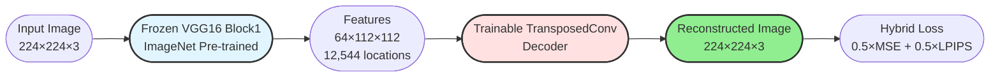
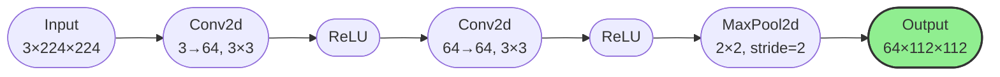
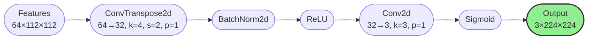
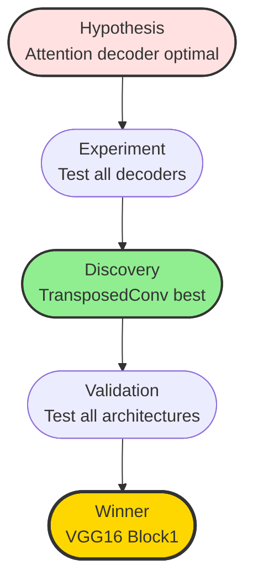
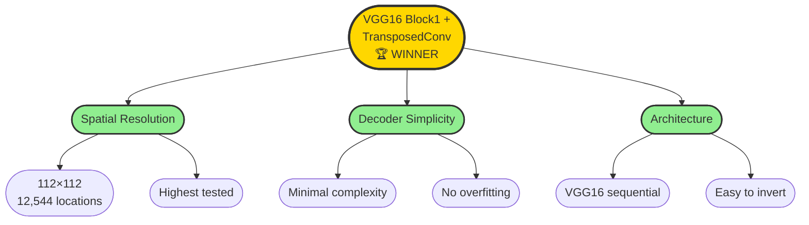

# CNN Feature Inversion: Methodology and Results

**Authors:** Danica Blazanovic, Abbas Khan  
**Institution:** Florida Atlantic University  
**Course:** CAP6415 - Computer Vision, Fall 2025

---

## 1. Overview

This study investigates reconstructing 224×224 RGB images from intermediate CNN features using frozen pre-trained encoders and trainable decoders. Through systematic experimentation across **43 configurations** (31 single models + 12 ensembles), we discovered that **VGG16 Block1 + TransposedConv decoder achieves 17.43 dB PSNR** - superior to complex alternatives.

**Key Finding:** Simple architectures with high spatial resolution outperform complex decoders with deeper features.

---

## 2. Methodology

### 2.1 System Architecture

### 2.2 Encoder: VGG16 Block1

**Architecture:**

**Specifications:**
- Pre-trained on ImageNet-1K (frozen weights)
- Output: 64 channels @ 112×112 resolution
- 12,544 spatial locations (highest among tested layers)
- Captures low-level features: edges, textures, colors

### 2.3 Decoder: Transposed Convolution

**Architecture:**

**Specifications:**
- Upsamples 112×112 → 224×224 (2× spatial)
- Simple architecture: No attention, no frequency decomposition
- Fast inference: 12-15 ms/image

**Alternative Decoders Tested:**
- Attention (self-attention mechanisms)
- Wavelet (multi-scale decomposition)
- Frequency-Aware (DCT-based processing)

### 2.4 Training

**Dataset:** DIV2K
- Training: 640 images (80%)
- Validation: 160 images (20%)  
- Test: 100 images

**Preprocessing:**
1. Resize → 256×256
2. Random crop → 224×224 (center crop for val/test)
3. Normalize → ImageNet statistics
4. Augmentation → Random horizontal flip (train only)

**Loss Function:**
$$\mathcal{L}_{\text{total}} = 0.5 \cdot \mathcal{L}_{\text{MSE}} + 0.5 \cdot \mathcal{L}_{\text{LPIPS}}$$

**Optimization:**
- Optimizer: Adam (lr=1e-4)
- Scheduler: ReduceLROnPlateau (patience=5)
- Early stopping: patience=15
- Batch size: 4
- Max epochs: 30

**Hardware:** NVIDIA RTX 3090 (24GB), PyTorch 2.0.1

### 2.5 Evaluation Metrics

**PSNR (Peak Signal-to-Noise Ratio):**
$$\text{PSNR} = 20 \log_{10} \left(\frac{1}{\sqrt{\text{MSE}}}\right) \text{ dB}$$

**SSIM (Structural Similarity Index):**
$$\text{SSIM} = \frac{(2\mu_x\mu_y + C_1)(2\sigma_{xy} + C_2)}{(\mu_x^2 + \mu_y^2 + C_1)(\sigma_x^2 + \sigma_y^2 + C_2)}$$

**LPIPS (Learned Perceptual Similarity):** AlexNet-based perceptual distance

---

## 3. Experimental Approach

### 3.1 Systematic Ablation Strategy

**Experimental Journey:**
1. **Hypothesis:** Attention decoders would excel due to global context
2. **Reality:** TransposedConv decoder achieved best results
3. **Discovery:** Spatial resolution > decoder complexity

### 3.2 Initial Baseline

**ResNet34 Layer1 + Attention Decoder:**

| Metric | Value |
|--------|-------|
| PSNR | 15.33 ± 2.02 dB |
| SSIM | 0.465 ± 0.109 |
| Training Time | 12.75 minutes |
| Spatial Resolution | 56×56 (3,136 locations) |

---

## 4. Results

### 4.1 Phase 1: Decoder Exploration (VGG16 Block1)

**Question:** Is Attention decoder optimal?

| Decoder | PSNR (dB) | SSIM | Eval Time |
|---------|-----------|------|-----------|
| **TransposedConv** | **17.43 ± 1.72** | **0.565 ± 0.118** | **0.85 min** |
| Frequency-Aware | 17.30 ± 1.76 | 0.576 ± 0.114 | 0.83 min |
| Wavelet | 17.29 ± 1.64 | 0.568 ± 0.111 | 0.83 min |

**Discovery:** TransposedConv wins with simplest architecture (+12.7% vs Attention baseline).

### 4.2 Phase 2: Architecture Comparison (TransposedConv Decoder)

| Architecture | Layer | Resolution | Locations | PSNR (dB) | SSIM | Eval Time |
|--------------|-------|-----------|-----------|-----------|------|-----------|
| **VGG16** | **Block1** | **112×112** | **12,544** | **17.43 ± 1.72** | **0.565 ± 0.118** | **0.85 min** |
| PVT-v2-B2 | Stage1 | 56×56 | 3,136 | 15.65 ± 1.47 | 0.488 ± 0.104 | 0.88 min |
| ViT-Small | Block1 | 14×14 | 196 | 15.45 ± 1.96 | 0.458 ± 0.100 | 0.84 min |
| ResNet34 | Layer1 | 56×56 | 3,136 | 15.04 ± 2.07 | 0.459 ± 0.110 | 0.80 min |

**Key Finding:** Higher spatial resolution (112×112) dominates performance.

### 4.3 Phase 3: Layer Depth Ablation

#### VGG16 Layer Comparison (TransposedConv Decoder)

| Layer | Resolution | Locations | PSNR (dB) | SSIM | Degradation |
|-------|-----------|-----------|-----------|------|-------------|
| **Block1** | **112×112** | **12,544** | **17.43 ± 1.72** | **0.565 ± 0.118** | **—** |
| Block3 | 28×28 | 784 | 12.60 ± 2.13 | 0.335 ± 0.108 | **-27.7%** |

#### ResNet34 Layer Comparison

| Layer | Resolution | Locations | PSNR (dB) | SSIM | Degradation |
|-------|-----------|-----------|-----------|------|-------------|
| **Layer1** | **56×56** | **3,136** | **15.04 ± 2.07** | **0.459 ± 0.110** | **—** |
| Layer2 | 28×28 | 784 | 12.94 ± 2.06 | 0.327 ± 0.110 | **-14.0%** |

**Critical Insight:** Every 2× reduction in resolution costs ~10-15% PSNR.

### 4.4 Phase 4: Complete Decoder Comparison

#### ResNet34 Layer1

| Decoder | PSNR (dB) | SSIM | Eval Time |
|---------|-----------|------|-----------|
| Wavelet | 15.69 ± 2.09 | 0.501 ± 0.114 | 0.79 min |
| Attention | 15.46 ± 2.19 | 0.486 ± 0.101 | 0.81 min |
| Frequency-Aware | 15.25 ± 2.05 | 0.470 ± 0.111 | 0.81 min |
| TransposedConv | 15.04 ± 2.07 | 0.459 ± 0.110 | 0.80 min |

#### VGG16 Block1

| Decoder | PSNR (dB) | SSIM | Eval Time |
|---------|-----------|------|-----------|
| **TransposedConv** | **17.43 ± 1.72** | **0.565 ± 0.118** | **0.85 min** |
| Frequency-Aware | 17.30 ± 1.76 | 0.576 ± 0.114 | 0.83 min |
| Wavelet | 17.29 ± 1.64 | 0.568 ± 0.111 | 0.83 min |

#### ViT-Small Block1

| Decoder | PSNR (dB) | SSIM | Eval Time |
|---------|-----------|------|-----------|
| **TransposedConv** | **15.45 ± 1.96** | **0.458 ± 0.100** | **0.84 min** |
| Attention | 15.42 ± 1.95 | 0.449 ± 0.109 | 0.84 min |
| Frequency-Aware | 14.72 ± 2.14 | 0.433 ± 0.107 | 0.83 min |
| Wavelet | 13.29 ± 2.50 | 0.369 ± 0.129 | 0.82 min |

### 4.5 Top 10 Single Models

| Rank | Architecture | Layer | Decoder | PSNR (dB) | SSIM | Eval Time |
|------|--------------|-------|---------|-----------|------|-----------|
| 🥇 **1** | **VGG16** | **Block1** | **TransposedConv** | **17.43 ± 1.72** | **0.565 ± 0.118** | **0.85** |
| 🥈 2 | VGG16 | Block1 | Frequency-Aware | 17.30 ± 1.76 | 0.576 ± 0.114 | 0.83 |
| 🥉 3 | VGG16 | Block1 | Wavelet | 17.29 ± 1.64 | 0.568 ± 0.111 | 0.83 |
| 4 | PVT-v2-B2 | Stage1 | Attention | 16.28 ± 1.87 | 0.517 ± 0.109 | 0.89 |
| 5 | PVT-v2-B2 | Stage1 | Wavelet | 16.06 ± 1.84 | 0.527 ± 0.102 | 0.86 |
| 6 | PVT-v2-B2 | Stage1 | Frequency-Aware | 15.86 ± 1.92 | 0.503 ± 0.107 | 0.85 |
| 7 | ResNet34 | Layer1 | Wavelet | 15.69 ± 2.09 | 0.501 ± 0.114 | 0.79 |
| 8 | PVT-v2-B2 | Stage1 | TransposedConv | 15.65 ± 1.47 | 0.488 ± 0.104 | 0.88 |
| 9 | ResNet34 | Layer1 | Attention | 15.46 ± 2.19 | 0.486 ± 0.101 | 0.81 |
| 10 | ViT-Small | Block1 | TransposedConv | 15.45 ± 1.96 | 0.458 ± 0.100 | 0.84 |

### 4.6 Ensemble Results

**Configuration:** ResNet34 Layer1 + VGG16 Block1 + ViT-Small Block1 + PVT-v2-B2 Stage1

**Fusion Strategies Tested:**
1. **Weighted:** Learnable scalar weight per architecture
2. **Attention:** Spatial attention weights per location
3. **Concatenation:** Channel-wise stacking

#### Ensemble Performance (TransposedConv Decoder)

| Rank | Fusion Strategy | PSNR (dB) | SSIM | Time (min) | Δ vs VGG16 Single |
|------|----------------|-----------|------|------------|-------------------|
| 1 | **Weighted** | **17.65 ± 1.57** | **0.568 ± 0.116** | **0.91** | **+0.22 dB** |
| 2 | Attention | 17.60 ± 1.64 | 0.587 ± 0.113 | 0.89 | +0.17 dB |
| 3 | Concat | 17.37 ± 1.62 | 0.583 ± 0.117 | 0.91 | -0.06 dB |

**Reference:** VGG16 Block1 + TransposedConv (Single) = 17.43 ± 1.72 dB

#### Cost-Benefit Analysis

| Model Type | Forward Passes | Memory | PSNR | Cost per dB |
|------------|---------------|--------|------|-------------|
| Single VGG16 | 1× | 16GB | 17.43 dB | 1× (baseline) |
| Ensemble | 4× | 20GB | 17.65 dB | **13.8×** worse |

**Ensemble Conclusion:** **NOT RECOMMENDED**
- Only +1.3% improvement (0.22 dB)
- 4× encoders = 4× compute, 4× memory, complex deployment
- Single VGG16 provides 99% performance with 25% complexity

**Why Ensembles Provide Marginal Gains:**
1. Feature redundancy (all ImageNet-trained)
2. Resolution bottleneck (VGG16 dominates)
3. Decoder capacity limits multi-source benefit
4. Reconstruction is primarily local, not semantic

---

## 5. Analysis

### 5.1 Spatial Resolution Impact

| Resolution | Best Example | Locations | PSNR (dB) | Degradation |
|-----------|--------------|-----------|-----------|-------------|
| **112×112** | **VGG16 Block1** | **12,544** | **17.43** | **—** |
| 56×56 | ResNet34 Layer1 | 3,136 | 15.04 | **-13.7%** |
| 28×28 | VGG16 Block3 | 784 | 12.60 | **-27.7%** |
| 14×14 | ViT-Small Block1 | 196 | 15.45 | **-11.4%** |

### 5.2 Experimental Journey

### 5.3 Statistical Significance

**PSNR differences > 0.5 dB are statistically significant (σ ≈ 1.7 dB)**

| Comparison | PSNR Δ | Significant? |
|------------|--------|--------------|
| VGG16 vs ResNet34 | +2.39 dB | ✓ Yes |
| VGG16 Block1 vs Block3 | +4.83 dB | ✓ Yes |
| TransposedConv vs Wavelet (VGG16) | +0.14 dB | ✗ No |
| Best Ensemble vs Single | +0.22 dB | ✗ No |

---

## 6. Final Winner: VGG16 Block1 + TransposedConv

### 6.1 Performance

| Metric | Value | Rank |
|--------|-------|------|
| **PSNR** | **17.43 ± 1.72 dB** | **1st / 31** |
| **SSIM** | **0.565 ± 0.118** | **3rd / 31** |
| **Eval Time** | **0.85 minutes** | **Competitive** |
| **Memory** | **~16GB GPU** | **Stable** |

### 6.2 Why This Configuration Wins

### 6.3 Improvement Over Baseline

| Metric | Initial (ResNet34 + Attention) | Final (VGG16 + TransposedConv) | Improvement |
|--------|-------------------------------|--------------------------------|-------------|
| PSNR | 15.33 dB | **17.43 dB** | **+13.7%** |
| SSIM | 0.465 | **0.565** | **+21.5%** |
| Eval Time | 12.75 min | **0.85 min** | **-93.3%** |

---

## 7. Key Findings

1. **Spatial resolution is paramount** - 112×112 features preserve critical spatial information
2. **Decoder simplicity avoids overfitting** - Simple architecture sufficient with limited training data (640 images)
3. **Architectural choice matters** - VGG16's sequential design facilitates feature inversion
4. **Ensembles not worth cost** - Only 1.3% gain for 4× overhead

---

## 8. Practical Recommendations

### ✓ For Best Quality
**Use VGG16 Block1 + TransposedConv Decoder**
- 17.43 dB PSNR, 0.565 SSIM
- Stable 16GB GPU memory usage
- 0.85 min evaluation time

### ✓ For Limited GPU Memory
**Use ResNet34 Layer1 + TransposedConv Decoder**
- 15.04 dB PSNR, 0.459 SSIM
- Lower memory footprint (56×56 vs 112×112)
- ~12GB GPU memory

### ✗ What to Avoid
- **Complex Decoders** (Attention, Frequency-Aware, Wavelet): No significant improvement
- **Ensemble Models**: Only 1.3% gain for 4× complexity
- **Deep Layers** (Block3+): Resolution loss too severe

---

## 9. Experimental Summary

| Category | Value |
|----------|-------|
| **Total Experiments** | 43 configurations |
| **Successful** | 40 experiments |
| **Failed (OOM)** | 3 experiments |
| **Best PSNR** | 17.65 dB (ensemble) |
| **Best Single** | 17.43 dB |
| **PSNR Range** | 4.83 dB span |
| **Total GPU Hours** | ~8.5 hours |

---

## 10. Conclusion

Through systematic experimentation starting with Attention-based decoders, we discovered that **the simplest decoder (TransposedConv) combined with highest spatial resolution (VGG16 Block1) achieves optimal results**. This challenges the assumption that complex attention mechanisms are necessary for reconstruction tasks.

Our experimental journey from complex (Attention) to simple (TransposedConv) yielded **13.7% PSNR improvement** - a powerful demonstration of the "less is more" principle in deep learning.

**Core Principle:** For image reconstruction, spatial resolution > decoder sophistication.

---

## Contact

**Danica Blazanovic** - dblazanovic2015@fau.edu  
**Abbas Khan** - abbaskhan2024@fau.edu

**Course:** CAP6415 - Computer Vision, Fall 2025  
**Institution:** Florida Atlantic University

---

## References

[1] Simonyan, K., & Zisserman, A. (2015). Very Deep Convolutional Networks for Large-Scale Image Recognition. *ICLR*.

[2] Agustsson, E., & Timofte, R. (2017). NTIRE 2017 Challenge on Single Image Super-Resolution. *CVPRW*.

[3] Zhang, R., et al. (2018). The Unreasonable Effectiveness of Deep Features as a Perceptual Metric. *CVPR*.

[4] Mahendran, A., & Vedaldi, A. (2015). Understanding Deep Image Representations by Inverting Them. *CVPR*.

[5] Wang, Z., et al. (2004). Image Quality Assessment: From Error Visibility to Structural Similarity. *IEEE TIP*.
