# Image Reconstruction from CNN Features: Systematic Ablation Study

**Authors:** Danica Blazanovic, Abbas Khan  
**Institution:** Florida Atlantic University  
**Course:** CAP6415 - Computer Vision, Fall 2025

---

## 1. Overview

This study investigates reconstructing 224×224 RGB images from intermediate CNN features through systematic ablation across **43 configurations** (31 single models + 12 ensembles).

**Baseline:** ResNet34 Layer1 + Attention → **13.53 dB PSNR**  
**Proposed:** VGG16 Block1 + TransposedConv → **17.36 dB PSNR** (+28.4% improvement)

**Key Finding:** High spatial resolution (112×112) with simple decoders outperforms deep features with complex decoders.

---

## 2. Methodology

### 2.1 System Architecture

```mermaid
graph LR
    A([Input Image<br/>224×224×3]) --> B([Frozen VGG16 Block1<br/>ImageNet Pre-trained])
    B --> C([Features<br/>64×112×112<br/>12,544 locations])
    C --> D([Trainable TransposedConv<br/>Decoder])
    D --> E([Reconstructed Image<br/>224×224×3])
    E --> F([Hybrid Loss<br/>0.5×MSE + 0.5×LPIPS])
    
    style B fill:#e1f5ff,stroke:#333,stroke-width:2px
    style D fill:#ffe1e1,stroke:#333,stroke-width:2px
    style E fill:#90EE90,stroke:#333,stroke-width:2px
```

### 2.2 Experimental Design

**Architectures × Layers Tested:**
- **ResNet34:** layer1 (56×56), layer2 (28×28)
- **VGG16:** block1 (112×112), block3 (28×28), block5 (7×7)
- **ViT-Small:** block0, block3, block6, block9, block11 (14×14, 196 tokens)
- **PVT-v2-B2:** stage0, stage1, stage2, stage3 (56×56 to 7×7)

**Decoders Tested:**
1. **Attention:** Multi-head self-attention + upsampling
2. **FrequencyAware:** DCT-based frequency decomposition
3. **Wavelet:** Multi-scale wavelet transforms
4. **TransposedConv:** Simple progressive upsampling

**Ensembles:**
- **Fusion:** Attention, Concat, Weighted
- **Architectures:** ResNet34 layer1 + VGG16 block1 + ViT-Small block1 + PVT-v2-B2 stage1

### 2.3 VGG16 Block1 Encoder

```mermaid
graph LR
    A([Input<br/>3×224×224]) --> B([Conv2d<br/>3→64, 3×3])
    B --> C([ReLU])
    C --> D([Conv2d<br/>64→64, 3×3])
    D --> E([ReLU])
    E --> F([MaxPool2d<br/>2×2, stride=2])
    F --> G([Output<br/>64×112×112])
    
    style G fill:#90EE90,stroke:#333,stroke-width:2px
```

**Specifications:**
- Pre-trained on ImageNet-1K (frozen weights)
- Output: 64 channels @ 112×112 resolution = **12,544 spatial locations**
- Captures low-level features: edges, textures, colors

### 2.4 TransposedConv Decoder

```mermaid
graph LR
    A([Features<br/>64×112×112]) --> B([ConvTranspose2d<br/>64→32, k=4, s=2, p=1])
    B --> C([BatchNorm2d])
    C --> D([ReLU])
    D --> E([Conv2d<br/>32→3, k=3, p=1])
    E --> F([Sigmoid])
    F --> G([Output<br/>3×224×224])
    
    style G fill:#90EE90,stroke:#333,stroke-width:2px
```

**Specifications:**
- Upsamples 112×112 → 224×224 (2× spatial)
- Simple: No attention, no frequency decomposition
- Parameters: ~200K (12× fewer than Attention decoder)
- Fast inference: ~0.9 min/100 images

### 2.5 Training Details

| Parameter | Value |
|-----------|-------|
| Dataset | DIV2K (640 train, 160 val, 100 test) |
| Loss | 0.5 × MSE + 0.5 × LPIPS (AlexNet) |
| Optimizer | Adam (lr=1e-4) |
| Scheduler | ReduceLROnPlateau (patience=5) |
| Early Stopping | Patience 15 epochs |
| Max Epochs | 30 |
| Batch Size | 4 |
| Hardware | NVIDIA RTX 6000 Ada (48GB) |

### 2.6 Evaluation Metrics

- **PSNR:** Peak Signal-to-Noise Ratio (dB, higher better)
- **SSIM:** Structural Similarity Index (0-1, higher better)
- All metrics: mean ± std over 100 test images

---

## 3. Baseline Results

### 3.1 Initial Configuration

**ResNet34 Layer1 + Attention Decoder**

| Metric | Value |
|--------|-------|
| PSNR | 13.53 ± 2.48 dB |
| SSIM | 0.376 ± 0.118 |
| Training Time | ~30 min |
| Eval Time | 0.85 min |

**Observation:** Complex attention decoder with moderate spatial resolution (56×56, 3,136 locations) provides baseline performance.

---

## 4. Systematic Ablation Study

### 4.1 Ablation 1: Architecture Comparison (TransposedConv Decoder)

**Question:** Which architecture provides best features for reconstruction?

| Architecture | Layer | Spatial Res | PSNR (dB) | SSIM | Δ from Baseline |
|--------------|-------|-------------|-----------|------|-----------------|
| **VGG16** | **block1** | **112×112** | **17.36 ± 1.76** | **0.547 ± 0.121** | **+28.4%** |
| PVT-v2-B2 | stage1 | 56×56 | 16.54 ± 1.81 | 0.533 ± 0.101 | +22.3% |
| ResNet34 | layer1 | 56×56 | 15.04 ± 2.07 | 0.459 ± 0.110 | +11.2% |
| ViT-Small | block0 | 14×14 (196 tokens) | 14.20 ± 2.24 | 0.408 ± 0.114 | +5.0% |

**Finding:** VGG16 block1's 112×112 features (12,544 locations) provide **28.4% PSNR improvement** over baseline. Spatial resolution is dominant factor.

### 4.2 Ablation 2: Layer Depth Impact (VGG16 + TransposedConv)

**Question:** How does layer depth affect reconstruction quality?

| Layer | Spatial Res | Locations | PSNR (dB) | SSIM | Degradation |
|-------|-------------|-----------|-----------|------|-------------|
| **block1** | **112×112** | **12,544** | **17.36 ± 1.76** | **0.547 ± 0.121** | **—** |
| block3 | 28×28 | 784 | 12.71 ± 2.02 | 0.320 ± 0.110 | **-26.8%** |
| block5 | 7×7 | 49 | 12.26 ± 1.83 | 0.269 ± 0.099 | **-29.4%** |

**Finding:** Progressive degradation with depth. Block5 (7×7) loses **29.4% PSNR** vs block1 (112×112). Spatial downsampling irreversibly destroys information.

### 4.3 Ablation 3: Decoder Complexity (VGG16 Block1)

**Question:** Do complex decoders improve reconstruction?

| Decoder | PSNR (dB) | SSIM | Params | Eval Time |
|---------|-----------|------|--------|-----------|
| **TransposedConv** | **17.36 ± 1.76** | **0.547 ± 0.121** | **~200K** | **0.90 min** |
| Wavelet | 17.15 ± 1.68 | 0.553 ± 0.122 | ~400K | 0.87 min |
| FrequencyAware | 16.91 ± 1.75 | 0.544 ± 0.113 | ~350K | 0.88 min |
| Attention | 12.99 ± 2.58 | 0.380 ± 0.119 | ~2.5M | 0.85 min |

**Finding:** Simple TransposedConv achieves best PSNR despite **12× fewer parameters** than Attention decoder. Complex decoders hurt performance (Attention: -25.2% PSNR).

### 4.4 Ablation 4: Cross-Architecture Decoder Analysis

#### ResNet34 Layer1

| Decoder | PSNR (dB) | SSIM | Δ from TransposedConv |
|---------|-----------|------|-----------------------|
| Wavelet | 15.65 ± 2.27 | 0.509 ± 0.095 | +4.1% |
| FrequencyAware | 15.19 ± 2.02 | 0.462 ± 0.110 | +1.0% |
| **TransposedConv** | **15.04 ± 2.07** | **0.459 ± 0.110** | **—** |
| Attention | 13.53 ± 2.48 | 0.376 ± 0.118 | -10.0% |

#### ViT-Small Block0

| Decoder | PSNR (dB) | SSIM | Δ from TransposedConv |
|---------|-----------|------|-----------------------|
| FrequencyAware | 14.70 ± 2.20 | 0.442 ± 0.109 | +3.5% |
| Attention | 14.33 ± 2.18 | 0.427 ± 0.109 | +0.9% |
| **TransposedConv** | **14.20 ± 2.24** | **0.408 ± 0.114** | **—** |
| Wavelet | 13.38 ± 2.41 | 0.382 ± 0.116 | -5.8% |

**Finding:** No single decoder wins across all architectures. VGG16 benefits most from TransposedConv (+2.45 dB vs FrequencyAware).

### 4.5 Ablation 5: Ensemble vs Single Model

**Configuration:** ResNet34 layer1 + VGG16 block1 + ViT-Small block1 + PVT-v2-B2 stage1

#### Best Ensembles (TransposedConv Decoder)

| Rank | Fusion | PSNR (dB) | SSIM | Δ vs Best Single |
|------|--------|-----------|------|------------------|
| 1 | Attention | 17.58 ± 1.68 | 0.581 ± 0.117 | +0.22 dB (+1.3%) |
| 2 | Weighted | 17.41 ± 1.60 | 0.562 ± 0.117 | +0.05 dB (+0.3%) |
| 3 | Concat | 17.29 ± 1.60 | 0.567 ± 0.115 | -0.07 dB (-0.4%) |

**Reference:** VGG16 block1 + TransposedConv = **17.36 ± 1.76 dB**

**Finding:** Best ensemble gains only **0.22 dB (1.3%)** over best single model despite 4× computational cost. **Not recommended** for practical use.

---

## 5. Top-10 Model Ranking

| Rank | Architecture | Layer | Decoder | PSNR (dB) | SSIM | Type |
|------|--------------|-------|---------|-----------|------|------|
| 1 | Ensemble | All | Attention + TransposedConv | 17.58 ± 1.68 | 0.581 | Ensemble |
| 2 | Ensemble | All | Weighted + TransposedConv | 17.41 ± 1.60 | 0.562 | Ensemble |
| **3** | **VGG16** | **block1** | **TransposedConv** | **17.36 ± 1.76** | **0.547** | **Single** |
| 4 | Ensemble | All | Concat + FrequencyAware | 17.39 ± 1.51 | 0.569 | Ensemble |
| 5 | Ensemble | All | Weighted + FrequencyAware | 17.34 ± 1.59 | 0.578 | Ensemble |
| 6 | Ensemble | All | Concat + Wavelet | 17.33 ± 1.63 | 0.582 | Ensemble |
| 7 | VGG16 | block1 | Wavelet | 17.15 ± 1.68 | 0.553 | Single |
| 8 | VGG16 | block1 | FrequencyAware | 16.91 ± 1.75 | 0.544 | Single |
| 9 | PVT-v2-B2 | stage1 | TransposedConv | 16.54 ± 1.81 | 0.533 | Single |
| 10 | PVT-v2-B2 | stage1 | Attention | 16.28 ± 1.87 | 0.517 | Single |

---

## 6. Key Findings

### 6.1 Experimental Journey

### 6.2 Spatial Resolution Dominates Performance
- **112×112 (VGG16 block1):** 17.36 dB
- **56×56 (ResNet34 layer1):** 15.04 dB (-13.4%)
- **28×28 (VGG16 block3):** 12.71 dB (-26.8%)
- **7×7 (VGG16 block5):** 12.26 dB (-29.4%)

**Conclusion:** Each 2× spatial reduction costs ~10-15% PSNR.

### 6.3 Simple Decoders Outperform Complex Ones
- **TransposedConv (simple):** 17.36 dB, 200K params
- **Attention (complex):** 12.99 dB, 2.5M params (-25.2%)

**Conclusion:** Decoder simplicity prevents overfitting on limited data (640 images).

### 6.4 Ensembles Provide Marginal Gains
- **Best ensemble:** 17.58 dB
- **Best single:** 17.36 dB
- **Improvement:** +0.22 dB (1.3%) for 4× compute cost

**Conclusion:** Single VGG16 block1 model preferred for deployment.

### 6.5 Architecture Choice Matters
VGG16's sequential design with large early feature maps enables superior reconstruction vs ResNet's aggressive early downsampling.

### 6.6 Deep Features Lose Spatial Information
Semantic abstraction in deep layers (block3+, layer2+) irreversibly destroys fine-grained spatial details needed for reconstruction.

---

## 7. Statistical Analysis

### 7.1 Significance Testing

**PSNR differences > 0.5 dB are statistically significant (σ ≈ 1.7 dB)**

| Comparison | Δ PSNR | Significant? |
|------------|--------|--------------|
| VGG16 block1 vs ResNet34 layer1 | +2.32 dB | ✓ Yes |
| VGG16 block1 vs block3 | +4.65 dB | ✓ Yes |
| VGG16 block1 vs block5 | +5.10 dB | ✓ Yes |
| TransposedConv vs Wavelet (VGG16) | +0.21 dB | ✗ No |
| Best Ensemble vs Best Single | +0.22 dB | ✗ No |

### 7.2 Baseline vs Proposed

| Metric | Baseline (ResNet34 + Attention) | Proposed (VGG16 + TransposedConv) | Improvement |
|--------|--------------------------------|----------------------------------|-------------|
| **PSNR** | 13.53 ± 2.48 dB | **17.36 ± 1.76 dB** | **+28.4%** |
| **SSIM** | 0.376 ± 0.118 | **0.547 ± 0.121** | **+45.5%** |
| **Consistency** | σ = 2.48 | **σ = 1.76** | **-29.0% variance** |

### 7.3 Why VGG16 Block1 + TransposedConv Wins

```mermaid
graph TB
    Root([VGG16 Block1 +<br/>TransposedConv<br/>🏆 WINNER])
    
    Root --> A([Spatial Resolution])
    A --> A1([112×112<br/>12,544 locations])
    A --> A2([Highest tested])
    
    Root --> B([Decoder Simplicity])
    B --> B1([Minimal complexity])
    B --> B2([No overfitting])
    
    Root --> C([Architecture])
    C --> C1([VGG16 sequential])
    C --> C2([Easy to invert])
    
    style Root fill:#FFD700,stroke:#333,stroke-width:3px
    style A fill:#90EE90,stroke:#333,stroke-width:2px
    style B fill:#90EE90,stroke:#333,stroke-width:2px
    style C fill:#90EE90,stroke:#333,stroke-width:2px
```

---

## 8. Practical Recommendations

### ✓ Recommended Configuration

**VGG16 Block1 + TransposedConv Decoder**

**Why:**
- Best single model: 17.36 dB PSNR
- Simple deployment (1 encoder, 200K decoder)
- 99% of ensemble performance at 25% cost
- Fast inference: ~0.9 min/100 images

**Use Cases:**
- Feature visualization
- Model interpretability
- Image compression analysis
- Real-time reconstruction (with optimization)

### ⚠️ Not Recommended

**Ensembles:**
- Only 1.3% improvement over single model
- 4× computational overhead
- Complex deployment
- Marginal quality gain not worth cost

**Complex Decoders (Attention, FrequencyAware, Wavelet):**
- No consistent improvement over TransposedConv
- Higher parameter count → overfitting risk
- Slower inference
- Added complexity without benefit

**Deep Layers (block3+, layer2+):**
- Severe PSNR degradation (>25%)
- Spatial information irreversibly lost
- No decoder can recover deep feature information

---

## 9. Ablation Summary

| Ablation | Variable | Winner | Key Insight |
|----------|----------|--------|-------------|
| **1. Architecture** | ResNet, VGG, ViT, PVT | **VGG16** | Large early features (112×112) critical |
| **2. Layer Depth** | block1, block3, block5 | **block1** | Shallow layers preserve spatial details |
| **3. Decoder** | Attention, Freq, Wavelet, TransposedConv | **TransposedConv** | Simplicity prevents overfitting |
| **4. Ensemble** | Single vs Multi-arch | **Single** | Marginal gain (1.3%) not worth 4× cost |

**Central Principle:** Spatial resolution > decoder sophistication

---

## 10. Experimental Statistics

| Metric | Value |
|--------|-------|
| **Total Configurations** | 43 (31 single + 12 ensemble) |
| **Successful Runs** | 43 |
| **Best PSNR (Overall)** | 17.58 dB (ensemble) |
| **Best PSNR (Single)** | 17.36 dB (VGG16 block1 + TransposedConv) |
| **Worst PSNR** | 12.26 dB (VGG16 block5 + TransposedConv) |
| **PSNR Range** | 5.32 dB |
| **Total GPU Hours** | ~35 hours |
| **Avg Training Time** | ~50 min/model |

---

## 11. Conclusion

Through systematic ablation across architectures, layers, and decoders, we established that **simple TransposedConv decoders with high spatial resolution features (VGG16 block1, 112×112) achieve optimal reconstruction quality (17.36 dB PSNR)**. This represents a **28.4% improvement** over our baseline (ResNet34 layer1 + Attention, 13.53 dB).

**Core Finding:** Spatial resolution preservation dominates reconstruction quality. Complex decoders and ensemble approaches provide marginal or negative returns. The "less is more" principle applies: simple architectures with rich spatial features outperform complex designs with abstract features.

**Recommended Configuration:** VGG16 Block1 + TransposedConv decoder for optimal quality-complexity tradeoff.

---

## Contact

**Danica Blazanovic** - dblazanovic2015@fau.edu  
**Abbas Khan** - abbaskhan2024@fau.edu

**Course:** CAP6415 - Computer Vision, Fall 2025  
**Institution:** Florida Atlantic University

---

## References

[1] Simonyan, K., & Zisserman, A. (2015). Very Deep Convolutional Networks for Large-Scale Image Recognition. *ICLR*.

[2] Mahendran, A., & Vedaldi, A. (2015). Understanding Deep Image Representations by Inverting Them. *CVPR*.

[3] Zhang, R., et al. (2018). The Unreasonable Effectiveness of Deep Features as a Perceptual Metric. *CVPR*.

[4] Agustsson, E., & Timofte, R. (2017). NTIRE 2017 Challenge on Single Image Super-Resolution. *CVPRW*.
