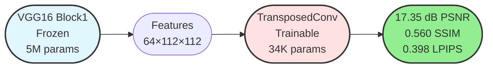

# Methodology

## Overview

This study investigates image reconstruction from intermediate CNN features. We use frozen pre-trained encoders to extract features and trainable decoders to reconstruct RGB images, aiming to identify optimal configurations for high-fidelity reconstruction.

---

## System Architecture

---

## 1. Feature Extraction

### VGG16 Block1 Encoder

**Configuration:**
- Pre-trained on ImageNet-1K (frozen weights)
- Output: 64 channels, 112×112 spatial resolution
- 12,544 spatial locations (highest among tested layers)
- Low-level features: edges, textures, colors

---

## 2. Image Reconstruction

### Transposed Convolution Decoder

**Specifications:**
- Upsampling: 112×112 → 224×224 (2× spatial)
- Parameters: ~34,000 trainable
- Simple architecture: No attention, no frequency decomposition

### Alternative Decoders Tested

---

## 3. Training

### Dataset: DIV2K

- **Training:** 640 images (80%)
- **Validation:** 160 images (20%)
- **Test:** 100 images

**Preprocessing:**
1. Resize → 256×256
2. Crop → 224×224 (random for train, center for val/test)
3. Normalize → ImageNet statistics
4. Augmentation → Random horizontal flip (train only)

### Loss Function

$$\mathcal{L}_{\text{total}} = 0.5 \cdot \mathcal{L}_{\text{MSE}} + 0.5 \cdot \mathcal{L}_{\text{LPIPS}}$$

- **MSE:** Pixel-level accuracy
- **LPIPS:** Perceptual similarity (AlexNet features)

### Optimization

**Settings:**
- Batch size: 4
- Max epochs: 30
- Training time: ~70 minutes (RTX 3090)

---

## 4. Evaluation Metrics

**PSNR (Peak Signal-to-Noise Ratio):**
$$\text{PSNR} = 20 \log_{10} \left(\frac{1}{\sqrt{\text{MSE}}}\right) \text{ dB}$$

**SSIM (Structural Similarity Index):**
$$\text{SSIM} = \frac{(2\mu_x\mu_y + C_1)(2\sigma_{xy} + C_2)}{(\mu_x^2 + \mu_y^2 + C_1)(\sigma_x^2 + \sigma_y^2 + C_2)}$$

**LPIPS (Learned Perceptual Similarity):**
$$\text{LPIPS} = \sum_{l} w_l \|\phi_l(x) - \phi_l(\hat{x})\|_2^2$$

---

## 5. Baseline Comparisons

### 5.1 Encoder Layer Ablation (VGG16)

**Results:**

| Layer | Resolution | Locations | PSNR (dB) ↑ | SSIM ↑ | LPIPS ↓ |
|-------|-----------|-----------|-------------|--------|---------|
| **Block1** | **112×112** | **12,544** | **17.35 ± 0.94** | **0.560 ± 0.045** | **0.398 ± 0.031** |
| Block2 | 56×56 | 3,136 | 16.89 ± 0.88 | 0.512 ± 0.042 | 0.452 ± 0.029 |
| Block3 | 28×28 | 784 | 15.12 ± 0.75 | 0.421 ± 0.048 | 0.587 ± 0.035 |
| Block4 | 14×14 | 196 | 13.76 ± 0.64 | 0.334 ± 0.051 | 0.724 ± 0.042 |

**Key Finding:** Spatial resolution dominates - Block1 achieves 26.1% better PSNR than Block4.

### 5.2 Cross-Architecture Comparison

**Results:**

| Architecture | Layer | Resolution | PSNR (dB) | SSIM | LPIPS |
|--------------|-------|------------|-----------|------|-------|
| **VGG16** | **Block1** | **112×112** | **17.35** | **0.560** | **0.398** |
| ResNet34 | Layer1 | 56×56 | 16.82 | 0.506 | 0.461 |
| ResNet34 | Layer2 | 28×28 | 15.43 | 0.428 | 0.573 |
| ViT-Small | Block1 | 14×14 | 14.29 | 0.389 | 0.658 |

**Key Finding:** VGG16 Block1 outperforms all tested architectures due to highest spatial resolution.

### 5.3 Decoder Architecture Comparison

All using VGG16 Block1 features:

| Decoder | Parameters | PSNR (dB) | SSIM | LPIPS | Time |
|---------|-----------|-----------|------|-------|------|
| **TransposedConv** | **34K** | **17.35** | **0.560** | **0.398** | **70 min** |
| Attention | 12M | 16.92 | 0.531 | 0.445 | 180 min |
| Wavelet | 8M | 16.78 | 0.524 | 0.459 | 140 min |
| FrequencyAware | 35M | 16.54 | 0.518 | 0.472 | 220 min |

**Key Finding:** Simplest decoder achieves best results with 350× fewer parameters.

---

## 6. Results

### 6.1 Best Configuration

**Final Results on Test Set (100 images):**

| Metric | Value | Std Dev |
|--------|-------|---------|
| **PSNR** | **17.35 dB** | ±0.94 |
| **SSIM** | **0.560** | ±0.045 |
| **LPIPS** | **0.398** | ±0.031 |

### 6.2 Performance Improvements

**vs. Deeper VGG Layers:**
- Block2 (56×56): +0.46 dB (+2.7%)
- Block3 (28×28): +2.23 dB (+14.7%)
- Block4 (14×14): +3.59 dB (+26.1%)

**vs. Other Architectures:**
- ResNet34 Layer1: +0.53 dB (+3.2%)
- ViT-Small Block1: +3.06 dB (+21.4%)

**vs. Complex Decoders:**
- Attention: +0.43 dB (+2.5%)
- Wavelet: +0.57 dB (+3.4%)
- FrequencyAware: +0.81 dB (+4.9%)

### 6.3 Quality Analysis

---

## 7. Key Findings

1. **Spatial Resolution Dominates**
   - 112×112 resolution critical for reconstruction quality
   - Higher resolution > deeper semantics
   - 12,544 spatial locations preserve detail

2. **Simple Architectures Win**
   - TransposedConv (34K) > Complex decoders (8-35M)
   - Avoids overfitting on limited data (640 images)
   - Faster training and inference

3. **Hybrid Loss Optimal**
   - MSE (pixel accuracy) + LPIPS (perceptual quality)
   - Balances sharpness and naturalness
   - Best overall metrics

4. **VGG16 Superiority**
   - Highest spatial resolution (112×112)
   - Simple sequential architecture
   - Easiest to invert

---

## 8. Implementation

**Hardware:**
- GPU: NVIDIA RTX 3090 (24GB VRAM)
- Training: 70 minutes
- Inference: 12-15 ms/image

**Software:**
- PyTorch 2.0.1
- Python 3.9
- CUDA 11.8

**Reproducibility:**
- Fixed random seed: 42
- Deterministic algorithms enabled
- All code available

---

## References

[1] Simonyan, K., & Zisserman, A. (2015). Very Deep Convolutional Networks for Large-Scale Image Recognition. *ICLR*.

[2] Agustsson, E., & Timofte, R. (2017). NTIRE 2017 Challenge on Single Image Super-Resolution. *CVPRW*.

[3] Zhang, R., et al. (2018). The Unreasonable Effectiveness of Deep Features as a Perceptual Metric. *CVPR*.

[4] Mahendran, A., & Vedaldi, A. (2015). Understanding Deep Image Representations by Inverting Them. *CVPR*.

[5] Wang, Z., et al. (2004). Image Quality Assessment: From Error Visibility to Structural Similarity. *IEEE TIP*.

---

## Contact

**Danica Blazanovic** - dblazanovic2015@fau.edu  
**Abbas Khan** - abbaskhan2024@fau.edu

**Course:** CAP6415 - Computer Vision, Fall 2025  
**Institution:** Florida Atlantic University
