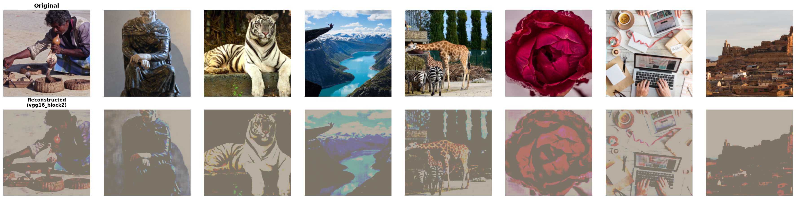
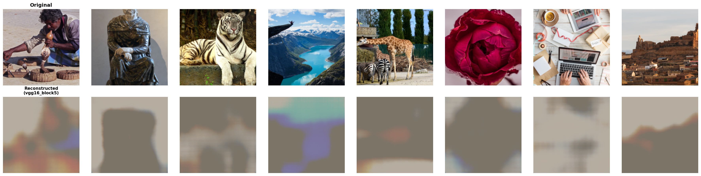
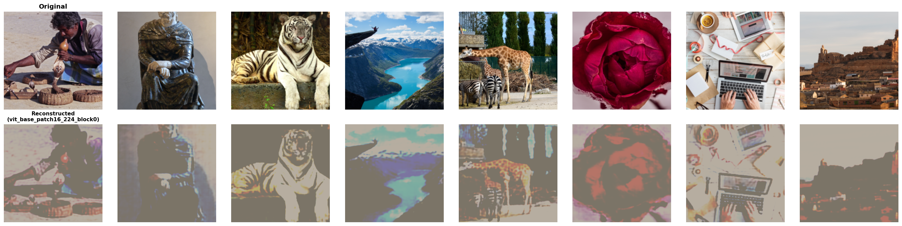
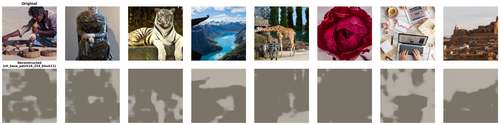

# Input Image Reconstruction from CNN Features

**Investigating optimal layer selection for image reconstruction across ResNet34, VGG16, and Vision Transformer architectures.**

**CAP6415 - Computer Vision | Fall 2025**  
**Team:** Danica Blazanovic, Abbas Khan

---

## Table of Contents

- [Overview](#overview)
- [Research Question](#research-question)
- [Methodology](#methodology)
  - [Pipeline](#pipeline)
  - [Decoder Architecture](#decoder-architecture)
  - [Evaluation Metrics](#evaluation-metrics)
- [Dataset](#dataset)
- [Architectures](#architectures)
- [Results](#results)
  - [ResNet34](#resnet34-results)
  - [VGG16](#vgg16-results)
  - [Vision Transformer](#vision-transformer-results)
  - [Cross-Architecture Comparison](#cross-architecture-comparison)
- [Key Findings](#key-findings)
- [Multi-Architecture Ensemble](#multi-architecture-ensemble)
- [References](#references)

---

## Overview

Convolutional neural networks learn hierarchical representations through progressive layers [1, 7]:
- **Shallow layers:** Low-level features (edges, textures) with high spatial resolution
- **Middle layers:** Parts and patterns with moderate resolution
- **Deep layers:** High-level semantics with low spatial resolution

This project investigates **feature inversion** - reconstructing original images from intermediate CNN features - to understand how much information is preserved at each layer depth.

---

## Research Question

**Can we reconstruct images from intermediate CNN features, and how does quality degrade with network depth?**

**Hypotheses:**
1. Reconstruction quality degrades monotonically with layer depth
2. Spatial resolution dominates reconstruction quality
3. Different architectures preserve information differently

---

## Methodology

### Pipeline

```
Original Image (224×224×3)
    ↓
Frozen Pre-trained Encoder f_θ(x)
    ↓
Features z = f_θ(x) (e.g., 256×14×14)
    ↓
Trainable Decoder g_ψ(z)
    ↓
Reconstructed Image x̂ (224×224×3)
    ↓
Metrics: PSNR, SSIM, LPIPS
```

**Training:**
- **Encoder:** Frozen pre-trained CNN extracts features
- **Decoder:** Trainable upsampling network with attention
- **Loss:** MSE between original and reconstructed images
- **Optimizer:** Adam with ReduceLROnPlateau scheduling
- **Duration:** 30 epochs on DIV2K

### Decoder Architecture

Progressive upsampling with self-attention [4]:

$$\text{Attention}(\mathbf{Q}, \mathbf{K}, \mathbf{V}) = \text{softmax}\left(\frac{\mathbf{Q}\mathbf{K}^T}{\sqrt{d_k}}\right)\mathbf{V}$$

**Components:**
- Transposed convolutions for upsampling
- Self-attention for global context
- Residual connections + batch normalization

**Note:** Decoder capacity scales with input dimensions (0.2M-15.4M params for CNNs, 34.6M for ViT).

### Evaluation Metrics

| Metric | Formula | Range | Better |
|--------|---------|-------|--------|
| **PSNR** | $10 \log_{10}(\text{MAX}^2/\text{MSE})$ | 0-∞ dB | Higher |
| **SSIM** | Structural similarity | 0-1 | Higher |
| **LPIPS** | Perceptual distance (AlexNet) | ≈0-1 | Lower |

All metrics computed on denormalized images clamped to [0,1]. Values reported as mean ± std over 100 test images.

---

## Dataset

**DIV2K [9]:** 800 high-resolution training images, 100 validation images

**Our Split:**
- Training: 640 images (80% of train)
- Validation: 160 images (20% of train)
- Test: 100 images (official validation set)

**Preprocessing:**
1. Resize to 256×256, crop to 224×224
2. Training: Random crop + horizontal flip
3. Test: Center crop (deterministic)
4. Normalize with ImageNet statistics

---

## Architectures

### ResNet34 [1]

| Layer | Features | Downsampling | Spatial Locations | Decoder Params |
|-------|----------|--------------|-------------------|----------------|
| layer1 | 64×56×56 | 4× | 3,136 | 250K |
| layer2 | 128×28×28 | 8× | 784 | 975K |
| layer3 | 256×14×14 | 16× | 196 | 3.9M |
| layer4 | 512×7×7 | 32× | 49 | 15.4M |

**Key:** Residual connections, gradual downsampling (2× per stage)

### VGG16 [2]

| Block | Features | Downsampling | Spatial Locations | Decoder Params |
|-------|----------|--------------|-------------------|----------------|
| block1 | 64×112×112 | 2× | 12,544 | ~200K |
| block2 | 128×56×56 | 4× | 3,136 | ~500K |
| block3 | 256×28×28 | 8× | 784 | ~1M |
| block4 | 512×14×14 | 16× | 196 | ~2M |
| block5 | 512×7×7 | 32× | 49 | ~4M |

**Key:** Simple sequential design, aggressive max pooling (2× per block)

### Vision Transformer (ViT) [5]

| Block | Features | Tokens | Decoder Params |
|-------|----------|--------|----------------|
| block0 | 768×14×14 | 196 | 34.6M |
| block1 | 768×14×14 | 196 | 34.6M |
| block5 | 768×14×14 | 196 | 34.6M |
| block8 | 768×14×14 | 196 | 34.6M |
| block11 | 768×14×14 | 196 | 34.6M |

**Key:** 16×16 patch embedding, constant token count (196), global self-attention

---

## Results

### ResNet34 Results

| Layer | PSNR (dB) ↑ | SSIM ↑ | LPIPS ↓ | Training (min) |
|-------|-------------|--------|---------|----------------|
| **layer1** | **14.32 ± 0.94** | **0.474 ± 0.045** | **0.455 ± 0.031** | 69.8 |
| layer2 | 14.04 ± 0.86 | 0.390 ± 0.042 | 0.555 ± 0.029 | 30.0 |
| layer3 | 13.12 ± 0.71 | 0.283 ± 0.045 | 0.782 ± 0.025 | 29.9 |
| layer4 | 12.72 ± 0.63 | 0.272 ± 0.046 | 0.867 ± 0.023 | 30.0 |

**Key Observations:**
- Layer1 best across all metrics despite 61× fewer decoder parameters than layer4
- Progressive degradation: 11.2% PSNR drop, 42.6% SSIM drop from layer1→layer4
- Strong correlation between spatial resolution (3,136→49 locations) and quality


*ResNet34 Layer1: High-quality spatial detail preservation*


*ResNet34 Layer4: Severe quality loss at 7×7 resolution*

### VGG16 Results

| Block | PSNR (dB) ↑ | SSIM ↑ | LPIPS ↓ | Training (min) |
|-------|-------------|--------|---------|----------------|
| **block1** | **14.45 ± 2.27** | **0.530 ± 0.121** | **0.398 ± 0.109** | 162.8 |
| block2 | 14.34 ± 0.94 | 0.495 ± 0.045 | 0.432 ± 0.031 | 12.9 |
| block3 | 14.01 ± 0.85 | 0.405 ± 0.044 | 0.536 ± 0.031 | 11.4 |
| block4 | 13.40 ± 0.69 | 0.305 ± 0.048 | 0.709 ± 0.038 | 11.5 |
| block5 | 12.68 ± 0.59 | 0.273 ± 0.047 | 0.880 ± 0.030 | 11.5 |

**Key Observations:**
- Block1 achieves highest quality across all architectures
- 112×112 features (12,544 locations) provide best spatial information
- Block2 nearly matches block1 (0.11 dB difference) with 4× fewer locations
- Requires 40GB GPU RAM for block1 training


*VGG16 Block2: Excellent quality at 56×56 resolution*


*VGG16 Block5: Poor reconstruction from 7×7 features*

### Vision Transformer Results

| Block | PSNR (dB) ↑ | SSIM ↑ | LPIPS ↓ | Training (min) |
|-------|-------------|--------|---------|----------------|
| **block0** | **14.29 ± 0.93** | **0.454 ± 0.045** | **0.509 ± 0.033** | 32.2 |
| block1 | 14.01 ± 0.87 | 0.377 ± 0.043 | 0.611 ± 0.027 | 32.5 |
| block5 | 13.89 ± 0.82 | 0.346 ± 0.044 | 0.654 ± 0.027 | 33.1 |
| block8 | 13.33 ± 0.71 | 0.289 ± 0.047 | 0.790 ± 0.031 | 33.7 |
| block11 | 12.85 ± 0.65 | 0.278 ± 0.046 | 0.861 ± 0.026 | 34.2 |

**Key Observations:**
- Block0 competitive with best CNN layers (14.29 dB) using only 196 tokens
- Constant token count (196) through all blocks, yet quality degrades 10.1%
- Suggests information loss through semantic abstraction in self-attention
- Large decoder (34.6M params) may contribute to efficiency vs CNNs


*ViT Block0: Competitive quality with 196 tokens*


*ViT Block11: Heavy abstraction in deep transformer layers*

### Cross-Architecture Comparison

#### Best Layer Comparison

| Architecture | Layer | PSNR (dB) | SSIM | LPIPS | Spatial Locations |
|--------------|-------|-----------|------|-------|-------------------|
| **VGG16** | **block1** | **14.45** | **0.530** | **0.398** | **12,544** |
| VGG16 | block2 | 14.34 | 0.495 | 0.432 | 3,136 |
| ResNet34 | layer1 | 14.32 | 0.474 | 0.455 | 3,136 |
| ViT | block0 | 14.29 | 0.454 | 0.509 | 196 |

#### Key Insights

1. **VGG16 block1 wins overall** across all metrics
2. **Spatial resolution dominates for CNNs:** VGG block2 and ResNet layer1 (both 56×56) achieve nearly identical quality (0.02 dB difference)
3. **ViT competitive with 16× fewer locations:** Achieves 14.29 dB with only 196 tokens vs 3,136 locations for CNNs
4. **Consistent degradation pattern:** All architectures show ~10-12% PSNR drop and ~40-50% SSIM drop from best to worst layer
5. **Training time scales with feature map size:** VGG block1 (162.8 min) vs ResNet layer4 (30.0 min)

**Caveat:** ViT uses 34.6M parameter decoder vs 0.2M-15.4M for CNNs - larger capacity may contribute to competitive performance.

---

## Key Findings

### 1. Spatial Resolution is Dominant for CNNs

VGG16 block1 (112×112, 12,544 locations) achieves best quality, but with diminishing returns:
- **VGG block1:** 14.45 dB
- **VGG block2 / ResNet layer1 (56×56):** 14.34 / 14.32 dB
- **Difference:** Only 0.11-0.13 dB despite 4× more spatial locations

For matched resolutions, architecture design matters little:
- **56×56:** VGG block2 (14.34 dB) vs ResNet layer1 (14.32 dB) - 0.02 dB difference
- **7×7:** ResNet layer4 (12.72 dB) vs VGG block5 (12.68 dB) - 0.04 dB difference

### 2. ViT Preserves Information Efficiently

ViT block0 achieves 14.29 dB with only 196 tokens vs 3,136 locations for comparable CNNs. Global self-attention enables efficient spatial information encoding, but note the 100-170× larger decoder capacity.

### 3. Progressive Quality Degradation

All architectures show consistent degradation with depth:
- **PSNR:** ~10-12% drop from best to worst layer
- **SSIM:** ~40-50% drop from best to worst layer
- Pattern holds despite different architectures (residual vs sequential vs transformer)

### 4. Practical Recommendations

**For best quality:**
- VGG16 block1 (14.45 dB) if 40GB+ GPU available
- ResNet34 layer1 (14.32 dB) for standard GPU - only 0.13 dB lower

**For efficiency:**
- ResNet34 layer1 offers best quality-per-resource ratio
- Avoid deep layers (layer3/4, block4/5) - poor quality despite high cost

**For research:**
- Shallow layers (first 1-2) most invertible (~14.3 dB PSNR)
- PSNR differences <0.1 dB typically negligible
- Report decoder capacity alongside metrics for fair comparison

---

## Multi-Architecture Ensemble

### Configuration

Combining features from four diverse architectures:
- **ResNet34 layer1** (64×56×56): Local textures
- **VGG16 block1** (64×112×112): Fine details
- **ViT-Small block1** (384×14×14): Global context
- **PVT-v2-B2 stage1** (64×56×56): Multi-scale features

**Fusion:** Attention-based weighting with 256-channel bottleneck at 28×28  
**Decoder:** Simple transposed convolution  
**Loss:** 0.5 × MSE + 0.5 × LPIPS

### Results

| Metric | Ensemble | Best Single (VGG block1) | Improvement |
|--------|----------|-------------------------|-------------|
| **PSNR (dB)** | **17.57** | 14.45 | **+3.12 dB (+21.6%)** |
| **SSIM** | **0.586** | 0.530 | **+0.056 (+10.6%)** |


*Multi-architecture ensemble: Superior texture and edge preservation*

### Key Insights

1. **Feature diversity > decoder complexity:** Simple decoder with diverse features outperforms complex decoders with single source
2. **Complementary information:** CNNs capture local details, Transformers capture global context
3. **Substantial improvement:** +3.12 dB over best single architecture
4. **Trade-off:** Increased memory (4 encoders) and inference time

---

## References

[1] He, K., et al. (2016). Deep Residual Learning for Image Recognition. *CVPR*.

[2] Simonyan, K., & Zisserman, A. (2015). Very Deep Convolutional Networks. *ICLR*.

[3] Mahendran, A., & Vedaldi, A. (2015). Understanding deep image representations by inverting them. *CVPR*.

[4] Vaswani, A., et al. (2017). Attention is All You Need. *NIPS*.

[5] Dosovitskiy, A., et al. (2021). An Image is Worth 16x16 Words. *ICLR*.

[7] Torralba, A., Isola, P., & Freeman, W. T. (2024). *Computer Vision*. MIT Press.

[8] Zhang, R., et al. (2018). The unreasonable effectiveness of deep features as a perceptual metric. *CVPR*.

[9] Agustsson, E., & Timofte, R. (2017). NTIRE 2017 Challenge on Single Image Super-Resolution. *CVPRW*.

---

## Contact

**Danica Blazanovic** - dblazanovic2015@fau.edu  
**Abbas Khan** - abbaskhan2024@fau.edu

**Course:** CAP6415 - Computer Vision, Florida Atlantic University, Fall 2025

**Last Updated:** December 2025
