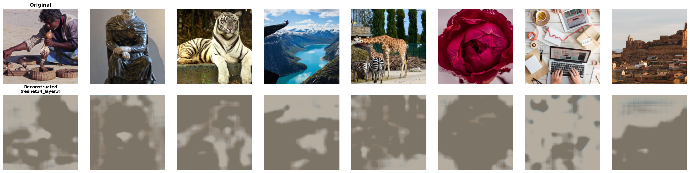
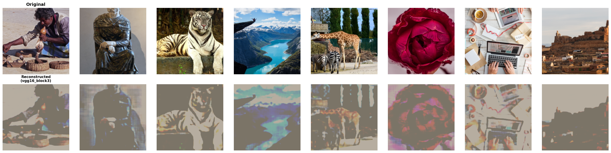
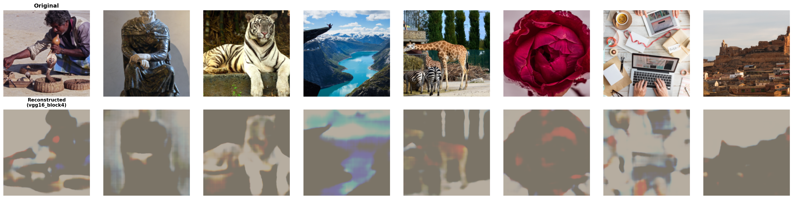
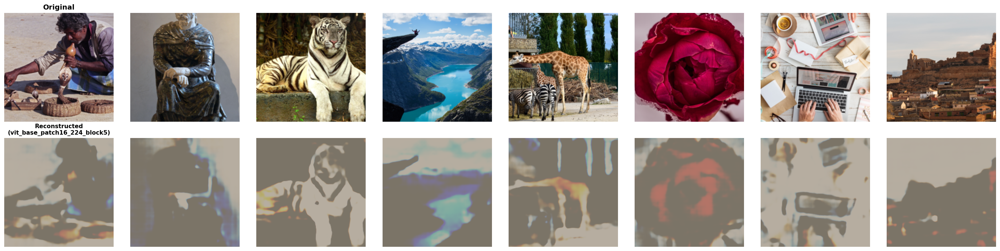
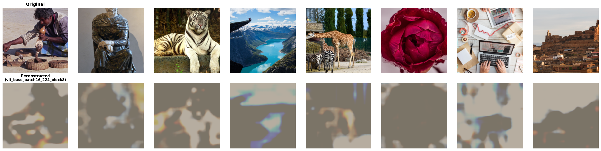

# Input Image Reconstruction from Features: Cross-Architecture Analysis

**Investigating optimal layer selection for decoder networks that reconstruct input images from intermediate feature representations across ResNet34, VGG16, and Vision Transformer architectures.**

**CAP6415 - Computer Vision | Fall 2025**

**Team Members:** Danica Blazanovic, Abbas Khan

---

## Table of Contents

- [Overview](#overview)
- [Background](#background)
- [Research Question](#research-question)
- [Methodology](#methodology)
- [Dataset](#dataset)
- [Architectures Tested](#architectures-tested)
- [Results](#results)
  - [ResNet34 Results](#resnet34-results)
  - [VGG16 Results](#vgg16-results)
  - [ViT Results](#vit-results)
  - [Cross-Architecture Comparison](#cross-architecture-comparison)
- [Key Findings](#key-findings)
- [Installation](#installation)
- [Usage](#usage)
- [Project Structure](#project-structure)
- [References](#references)

---

## Overview

This project investigates how much spatial information is preserved at different depths of convolutional neural networks (CNNs) and Vision Transformers (ViTs). We train decoder networks to reconstruct original images from intermediate layer features, revealing how reconstruction difficulty increases as networks process images through deeper layers.

**Core Insight:** Early layers preserve fine-grained spatial details essential for reconstruction, while deeper layers encode increasingly abstract semantic concepts at the cost of spatial resolution.

---

## Background

### Hierarchical Feature Learning

Convolutional neural networks learn hierarchical representations through progressive spatial downsampling and increasing semantic abstraction [1, 7 Ch.24]. CNNs build features hierarchically:

- **Shallow layers:** Detect low-level features (edges, textures, colors) with high spatial resolution
- **Middle layers:** Combine low-level features into parts and patterns
- **Deep layers:** Encode high-level semantic concepts (objects, scenes) with low spatial resolution

This hierarchical structure creates a fundamental tradeoff between spatial detail and semantic information.

### Feature Inversion

Feature inversion attempts to reconstruct the original image $\mathbf{x}$ from intermediate features $\mathbf{z}$ extracted at layer $l$ [3, 7 Ch.30]. Given a frozen pre-trained encoder $f_\theta(\mathbf{x})$ and a trainable decoder $g_\psi(\mathbf{z})$, we optimize:

$$\min_\psi \mathbb{E}_{\mathbf{x}} \left[ \|\mathbf{x} - g_\psi(f_\theta(\mathbf{x}))\|^2 \right]$$

The quality of reconstruction reveals how much information about the original image is preserved in features at depth $l$. This inversion process demonstrates that deeper features are empirically more difficult to recover with learned decoders [3].

### Data Processing and Spatial Downsampling

Original DIV2K images (~2040×1356 average resolution, varying dimensions) are resized to 224×224 for computational efficiency [7 Ch.21]. This initial preprocessing results in anisotropic downsampling: approximately 9.1× vertically and 6.1× horizontally (~55× reduction in total pixel area). Networks then progressively downsample further:

**ResNet34 downsampling:**

Initial stem (conv1 + maxpool): 224×224 → 56×56 (stride-2 conv7×7 followed by stride-2 maxpool3×3)

- **Layer1:** 56×56 (4× from input) → 3,136 spatial locations
- **Layer2:** 28×28 (8× from input) → 784 spatial locations  
- **Layer3:** 14×14 (16× from input) → 196 spatial locations
- **Layer4:** 7×7 (32× from input) → 49 spatial locations

**VGG16 downsampling:**

Each block ends with stride-2 maxpool2×2:

- **Block1:** 224×224 → 112×112 (2× from input) → 12,544 spatial locations
- **Block2:** 112×112 → 56×56 (4× from input) → 3,136 spatial locations
- **Block3:** 56×56 → 28×28 (8× from input) → 784 spatial locations
- **Block4:** 28×28 → 14×14 (16× from input) → 196 spatial locations
- **Block5:** 14×14 → 7×7 (32× from input) → 49 spatial locations

**ViT downsampling:**

Single initial patch embedding (16×16 patches): 224×224 → 14×14 tokens (196 spatial tokens, constant through all blocks)

This 64× reduction in spatial locations from layer1 to layer4 (ResNet/VGG) strongly limits reconstruction quality, as spatial information lost through pooling and striding operations is highly compressive and challenging to recover with our decoder architectures.

---

## Research Question

**Can we reconstruct original images from intermediate CNN features, and how does reconstruction quality degrade with network depth?**

We hypothesize that:
1. Reconstruction quality degrades monotonically with layer depth
2. Spatial resolution is a dominant factor for reconstruction
3. Different architectures exhibit different information preservation characteristics

---

## Methodology

### Experimental Pipeline
```
Original Image (224×224×3)
    ↓
[Frozen Pre-trained Encoder f_θ(x)]
    ↓
Features z = f_θ(x) (e.g., 256×14×14)
    ↓
[Trainable Decoder g_ψ(z)]
    ↓
Reconstructed Image x̂ = g_ψ(z) (224×224×3)
    ↓
Evaluation Metrics (PSNR, SSIM, LPIPS)
```

### Training Procedure

Following the feature inversion framework [3], we implement the following training procedure:

1. **Encoder:** Pre-trained CNN (frozen weights) extracts features $\mathbf{z} = f_\theta(\mathbf{x})$ from a specific layer
2. **Decoder:** Trainable upsampling network $g_\psi(\mathbf{z})$ with attention mechanisms learns to reconstruct original images
3. **Loss Function:** Mean Squared Error between original and reconstructed images:

$$L(\psi) = \frac{1}{N}\sum_{i=1}^{N} \|\mathbf{x}_i - g_\psi(f_\theta(\mathbf{x}_i))\|^2$$

4. **Optimization:** Adam optimizer with ReduceLROnPlateau scheduling
5. **Training:** 30 epochs on DIV2K training images

### Decoder Architecture

We use an attention-based decoder inspired by transformer architectures [4, 7 Ch.26]:

**Architecture components:**
- Progressive upsampling via transposed convolutions
- Self-attention mechanisms for global context aggregation
- Residual connections for gradient flow
- Batch normalization and GELU activations

**Self-attention mechanism** [4]:

For input tokens $\mathbf{T} \in \mathbb{R}^{N \times D}$ (where $N$ is the number of spatial locations and $D$ is the feature dimension):

$$\mathbf{Q} = \mathbf{T}\mathbf{W}_q, \quad \mathbf{K} = \mathbf{T}\mathbf{W}_k, \quad \mathbf{V} = \mathbf{T}\mathbf{W}_v$$

where $\mathbf{W}_q, \mathbf{W}_k, \mathbf{W}_v \in \mathbb{R}^{D \times d_k}$ are learnable projection matrices, and $d_k = D / h$ is the dimension per attention head (where $h$ is the number of heads).

$$\text{Attention}(\mathbf{Q}, \mathbf{K}, \mathbf{V}) = \text{softmax}\left(\frac{\mathbf{Q}\mathbf{K}^T}{\sqrt{d_k}}\right)\mathbf{V}$$

This allows the decoder to aggregate information across spatial locations, partially compensating for lost spatial resolution.

**Note on decoder capacity:** CNN decoders range from 0.2M-15.4M parameters depending on input feature dimensions, while the ViT decoder is fixed at 34.6M parameters across all blocks. This capacity difference should be considered when comparing CNN vs ViT reconstruction efficiency - conclusions about ViT's efficiency may be partially attributable to decoder capacity rather than purely architectural advantages.

**Decoder Input Protocol:**

Decoders receive feature tensors directly from the encoder without intermediate projections or channel adaptation layers. No 1×1 convolutions or MLPs are used to equalize channel widths across architectures. This means:
- ResNet layer1 features (64 channels) → Decoder with 64-channel input
- VGG block5 features (512 channels) → Decoder with 512-channel input  
- ViT block features (768 channels) → Decoder with 768-channel input

Decoder capacity naturally scales with input feature dimensions, which contributes to the parameter count differences noted in architecture tables.

### Evaluation Metrics

We use four complementary metrics to assess reconstruction quality [8]:

- **PSNR**: Peak Signal-to-Noise Ratio
- **SSIM**: Structural Similarity Index
- **LPIPS**: Learned Perceptual Image Patch Similarity
- **MSE**: Mean Squared Error


| Metric | Formula | Range | Better | Interpretation |
|--------|---------|-------|--------|----------------|
| **PSNR** | $10 \log_{10}\left(\frac{\text{MAX}^2}{\text{MSE}}\right)$ | 0-∞ dB | Higher | Pixel-level accuracy |
| **SSIM** | $\text{SSIM}(x, y) = \frac{(2\mu_x\mu_y + c_1)(2\sigma_{xy} + c_2)}{(\mu_x^2 + \mu_y^2 + c_1)(\sigma_x^2 + \sigma_y^2 + c_2)}$ | 0-1* | Higher | Structural similarity |
| **LPIPS** | Deep feature distance using AlexNet | ≈0-1 | Lower | Perceptual quality |
| **MSE** | $\frac{1}{N}\sum(\mathbf{x} - \hat{\mathbf{x}})^2$ | 0-∞ | Lower | Raw pixel error |

*SSIM is typically in [0,1] but can be negative in edge cases.

**Metrics computation protocol:** 

Before computing PSNR, SSIM, and LPIPS, we denormalize reconstructed images (reversing ImageNet normalization) and clamp values to [0,1] range to ensure fair comparison with original images. All metrics computed on:
- **Color space:** RGB (3 channels)
- **Image size:** 224×224 (no resizing after reconstruction)
- **LPIPS backbone:** AlexNet with perceptual feature distance (images normalized to [-1,1] for LPIPS computation)
- **Channel ordering:** Channels-first for computation (C,H,W), converted to channels-last (H,W,C) for PSNR/SSIM via scikit-image

**Statistical reporting:** Reported values are mean ± standard deviation computed across the 100-image test set (DIV2K_valid_HR). The ± values represent image-wise variability (standard deviation across individual test images), not training variance or epoch-to-epoch fluctuations. Each metric is computed once per image on the final trained model, then aggregated: mean captures central tendency, standard deviation captures reconstruction consistency across different image content.

**Loss function and metric interpretation:** Our decoders optimize MSE loss during training, which naturally correlates with PSNR performance (PSNR = 10 log₁₀(1/MSE)). SSIM and LPIPS metrics provide complementary perspectives on structural similarity and perceptual quality respectively, but were not directly optimized during training. Therefore, claims about perceptual quality (LPIPS, visual assessment) should be interpreted as observed correlations rather than optimized objectives. For perceptually-optimized reconstruction, alternative loss functions (e.g., perceptual loss, GAN-based losses) would be required.

PSNR and MSE measure numerical accuracy, SSIM captures structural similarity, and LPIPS best correlates with human perception of image quality [8].

---

## Dataset

**DIV2K Dataset** [9]
- 800 high-resolution training images (~2K resolution, varying dimensions)
- Diverse natural scenes (landscapes, urban, portraits, objects)
- Resized to 224×224 for computational efficiency
- Official split: 800 train (DIV2K_train_HR), 100 validation (DIV2K_valid_HR)

**Data Usage in This Study:**

We split the 800 DIV2K training images into proper training and validation sets, and use the official DIV2K validation set (DIV2K_valid_HR) as our test set with publicly available ground truth:

- **Training:** 640 images (80% of DIV2K_train_HR) - used for model parameter updates
- **Validation:** 160 images (20% of DIV2K_train_HR) - used for learning rate scheduling and checkpoint selection
- **Test:** 100 images (DIV2K_valid_HR) - held-out set for final evaluation and reporting metrics

**Split Strategy:**

- Random seed 42 ensures reproducibility (set via `set_seed(42)` using NumPy)
- No overlap between training, validation, and test sets
- All three architectures (ResNet34, VGG16, ViT) use identical splits for fair comparison
- Validation set monitors training progress and prevents overfitting
- Test set provides unbiased evaluation of final model performance

This standard 640/160/100 (train/val/test) split ensures our reconstruction quality metrics reflect true generalization performance while maintaining fair cross-architecture comparisons.

**Preprocessing:**
1. Resize to 256×256 (bicubic interpolation, PyTorch default)
2. **Training:** Random crop to 224×224 + random horizontal flip (p=0.5)
3. **Validation/Test:** Center crop to 224×224 (deterministic)
4. Normalize with ImageNet statistics: $\mu=[0.485, 0.456, 0.406]$, $\sigma=[0.229, 0.224, 0.225]$
5. Denormalize before computing metrics (reverse normalization and clamp to [0,1])

---

## Architectures Tested

### 1. ResNet34 [1, 7 Ch.24]

**Layers Tested:** layer1, layer2, layer3, layer4

| Layer | Feature Shape | Downsampling Factor | Spatial Locations | Decoder Parameters |
|-------|---------------|---------------------|-------------------|-------------------|
| layer1 | 64 × 56 × 56 | 4× | 3,136 | 250K |
| layer2 | 128 × 28 × 28 | 8× | 784 | 975K |
| layer3 | 256 × 14 × 14 | 16× | 196 | 3.9M |
| layer4 | 512 × 7 × 7 | 32× | 49 | 15.4M |

**Architecture Characteristics:**
- Residual connections enable training of deep networks
- Uses basic blocks (two 3×3 convolutions per block)
- Gradual downsampling (2× per stage via stride-2 convolutions)

### 2. VGG16 [2, 7 Ch.24]

**Blocks Tested:** block1, block2, block3, block4, block5

| Block | Feature Shape | Downsampling Factor | Spatial Locations | Decoder Parameters |
|-------|---------------|---------------------|-------------------|-------------------|
| block1 | 64 × 112 × 112 | 2× | 12,544 | ~200K |
| block2 | 128 × 56 × 56 | 4× | 3,136 | ~500K |
| block3 | 256 × 28 × 28 | 8× | 784 | ~1M |
| block4 | 512 × 14 × 14 | 16× | 196 | ~2M |
| block5 | 512 × 7 × 7 | 32× | 49 | ~4M |

**Architecture Characteristics:**
- Simple sequential architecture with repeated conv-relu-pool blocks
- Aggressive downsampling (2× per block via max pooling)
- Larger feature maps in early layers compared to ResNet34

### 3. Vision Transformer (ViT)  [5, 7 Ch.26]

**Blocks Tested:** block0, block1, block5, block8, block11

| Block | Feature Shape | Patch Embedding | Token Count | Decoder Parameters |
|-------|---------------|-----------------|-------------|-------------------|
| block0 | 768 × 14 × 14 | 16×16 patches | 197 (196+CLS) | 34.6M |
| block1 | 768 × 14 × 14 | 16×16 patches | 197 (196+CLS) | 34.6M |
| block5 | 768 × 14 × 14 | 16×16 patches | 197 (196+CLS) | 34.6M |
| block8 | 768 × 14 × 14 | 16×16 patches | 197 (196+CLS) | 34.6M |
| block11 | 768 × 14 × 14 | 16×16 patches | 197 (196+CLS) | 34.6M |


**ViT Feature Extraction Details:**

For reconstruction, we extract features after transformer block $N$ as follows:
1. Images are split into 16×16 patches, embedded to 768 dimensions
2. Positional embeddings are added (learned during ImageNet pre-training)
3. Features pass through transformer blocks 0 to $N$
4. The class token (first token) is dropped, leaving 196 patch tokens
5. Tokens are reshaped from sequence format [196, 768] to spatial format [768, 14, 14]

**Important:** Positional embeddings from the encoder are NOT re-added when feeding features to the decoder. The decoder learns to reconstruct from the spatially-reshaped token features directly, which may lose some positional information encoded during pre-training. This represents a potential limitation compared to approaches that maintain explicit positional encodings through the reconstruction pipeline.

**Architecture Characteristics:**
- Patch-based architecture processes images as sequences of 16×16 patches
- Self-attention mechanisms enable global context aggregation [4]
- Constant token count (197) through all transformer blocks: 196 patch tokens + 1 class token
- For reconstruction, class token is dropped and 196 patch tokens are reshaped to 14×14 spatial grid
- Different information encoding paradigm compared to CNNs

**Note:** Feature shape shown is after reshaping patch tokens to spatial format for decoder input. The decoder architecture (34.6M parameters) is the same across all ViT blocks and is significantly larger than CNN decoders (0.2M-15.4M).

---

## Results

### ResNet34 Results

#### Quantitative Results

| Layer | PSNR (dB) ↑ | SSIM ↑ | LPIPS ↓ | Training Time (min) | Decoder Params |
|-------|-------------|--------|---------|---------------------|------------|
| **layer1** | **14.32 ± 0.94** | **0.474 ± 0.045** | **0.455 ± 0.031** | 69.8 | 250K |
| layer2 | 14.04 ± 0.86 | 0.390 ± 0.042 | 0.555 ± 0.029 | 30.0 | 975K |
| layer3 | 13.12 ± 0.71 | 0.283 ± 0.045 | 0.782 ± 0.025 | 29.9 | 3.9M |
| layer4 | 12.72 ± 0.63 | 0.272 ± 0.046 | 0.867 ± 0.023 | 30.0 | 15.4M |

**↑ Higher is better | ↓ Lower is better**

**Note:** PSNR differences <0.1 dB are typically negligible and within measurement noise.

#### Key Observations

1. **Layer1 achieves best quality across all metrics** despite having 61× fewer decoder parameters than layer4
2. **Progressive degradation:** Reconstruction quality degrades monotonically with depth
3. **SSIM drops 42.6%** from layer1 to layer4, indicating severe structural information loss
4. **LPIPS increases 90.7%** from 0.455 to 0.867, showing perceptual quality severely degrades
5. **Within-architecture parameter efficiency:** Layer1 achieves 17.5K params/dB while layer4 requires 1,177K params/dB. **Note:** This metric is decoder-size dependent and should only be compared within the same architecture (ResNet34 layers in this case), not across architectures (e.g., ResNet vs VGG vs ViT), as decoder capacity scales differently with feature map dimensions.

#### Visual Quality Analysis

- **Layer1 (56×56 features):** Sharp details, accurate colors, recognizable fine textures
- **Layer2 (28×28 features):** Slight blurring, colors generally preserved, structure intact
- **Layer3 (14×14 features):** Significant blurring, color shifts, loss of fine details
- **Layer4 (7×7 features):** Heavy blurring, abstract color patches, severely degraded structure

The reconstruction quality correlates strongly with spatial resolution. Layer1 with 3,136 spatial locations retains fine-grained details. Layer4 with only 49 spatial locations can only capture coarse color distributions.


- **Layer4 (7×7 features):** Heavy blurring, abstract color patches, severely degraded structure

The reconstruction quality correlates strongly with spatial resolution. Layer1 with 3,136 spatial locations retains fine-grained details. Layer4 with only 49 spatial locations can only capture coarse color distributions.


*Figure 1: ResNet34 Layer1 reconstruction examples showing high-quality preservation of spatial details.*


*Figure 2: ResNet34 Layer2 reconstructions with slight quality degradation.*


*Figure 3: ResNet34 Layer3 reconstructions showing significant blurring.*


*Figure 4: ResNet34 Layer4 reconstructions with severe quality loss.*

---
---

### VGG16 Results

#### Quantitative Results

| Block | PSNR (dB) ↑ | SSIM ↑ | LPIPS ↓ | Training Time (min) | Decoder Params |
|-------|-------------|--------|---------|---------------------|------------|
| **block1** | **14.45 ± 2.27** | **0.530 ± 0.121** | **0.398 ± 0.109** | 162.8 | ~200K |
| block2 | 14.34 ± 0.94 | 0.495 ± 0.045 | 0.432 ± 0.031 | 12.9 | ~500K |
| block3 | 14.01 ± 0.85 | 0.405 ± 0.044 | 0.536 ± 0.031 | 11.4 | ~1M |
| block4 | 13.40 ± 0.69 | 0.305 ± 0.048 | 0.709 ± 0.038 | 11.5 | ~2M |
| block5 | 12.68 ± 0.59 | 0.273 ± 0.047 | 0.880 ± 0.030 | 11.5 | ~4M |

**↑ Higher is better | ↓ Lower is better**

#### Key Observations

1. **Block1 achieves best overall quality** with PSNR of 14.45 dB and SSIM of 0.530 - the highest across all architectures and layers
2. **Larger feature maps enable better reconstruction:** Block1's 112×112 features (12,544 spatial locations) preserve significantly more information than ResNet34's layer1 (3,136 locations)
3. **Block2 closely matches block1** (14.34 dB vs 14.45 dB) with 4× fewer spatial locations, demonstrating diminishing returns
4. **Progressive degradation pattern similar to ResNet34:** Quality drops consistently through deeper blocks (48.5% SSIM drop from block1 to block5)
5. **Block5 shows worst performance** (12.68 dB), even lower than ResNet34 layer4

**Note:** Block1 training required Google Colab Pro with A100 GPU (40GB RAM) due to 112×112 feature map size. Batch size was reduced to 1 to fit in memory.

#### Visual Quality Analysis

- **Block1 (112×112 features):** Exceptional detail preservation, sharp edges, accurate fine textures
- **Block2 (56×56 features):** Very good quality, comparable to ResNet34 layer1
- **Block3 (28×28 features):** Moderate quality, visible blurring
- **Block4 (14×14 features):** Significant quality loss, details smoothed
- **Block5 (7×7 features):** Poor reconstruction, only coarse structure preserved


- **Block5 (7×7 features):** Poor reconstruction, only coarse structure preserved


*Figure 5: VGG16 Block2 reconstruction examples showing excellent quality.*


*Figure 6: VGG16 Block3 reconstructions with moderate quality.*


*Figure 7: VGG16 Block4 reconstructions showing quality degradation.*


*Figure 8: VGG16 Block5 reconstructions with poor quality.*

**Note:** Block1 reconstruction figure not available due to visualization failure during Colab training.

---
---

### ViT Results

#### Quantitative Results

| Block | PSNR (dB) ↑ | SSIM ↑ | LPIPS ↓ | Training Time (min) | Decoder Parameters |
|-------|-------------|--------|---------|---------------------|-------------------|
| **block0** | **14.29 ± 0.93** | **0.454 ± 0.045** | **0.509 ± 0.033** | 32.2 | 34.6M |
| block1 | 14.01 ± 0.87 | 0.377 ± 0.043 | 0.611 ± 0.027 | 32.5 | 34.6M |
| block5 | 13.89 ± 0.82 | 0.346 ± 0.044 | 0.654 ± 0.027 | 33.1 | 34.6M |
| block8 | 13.33 ± 0.71 | 0.289 ± 0.047 | 0.790 ± 0.031 | 33.7 | 34.6M |
| block11 | 12.85 ± 0.65 | 0.278 ± 0.046 | 0.861 ± 0.026 | 34.2 | 34.6M |

**↑ Higher is better | ↓ Lower is better**

#### Key Observations

1. **Block0 performs comparably to best CNN layers** (14.29 dB PSNR, 0.454 SSIM) despite different architecture paradigm
2. **Minimal difference between block0 and block1** (0.28 dB), suggesting early transformer blocks preserve similar information
3. **Progressive degradation through transformer depth:** Quality drops from 14.29 dB (block0) to 12.85 dB (block11), a 10.1% decrease
4. **Constant token count paradox:** Unlike CNNs, ViT maintains 196 patch tokens through all blocks, yet reconstruction quality still degrades with depth
5. **Hypothesis - information loss through semantic abstraction:** ViT's degradation with constant spatial tokens suggests that information loss may occur through semantic abstraction in self-attention rather than spatial downsampling, though this would require additional probing studies (e.g., attention rollout analysis) to confirm

#### Architecture-Specific Analysis

**Why ViT degrades differently than CNNs:**

Unlike CNNs that lose information through spatial downsampling, ViT processes all 196 patch tokens through every transformer block with constant token count. The quality degradation in deeper ViT blocks indicates:

1. **Self-attention may abstract away spatial details:** Even with constant spatial token count, attention mechanisms aggregate and abstract information, potentially losing fine-grained spatial patterns
2. **Token mixing reduces reconstructability:** As transformer blocks mix information across patches via attention, the direct correspondence between tokens and image regions may weaken
3. **Possible semantic vs. spatial tradeoff:** Later blocks may encode richer semantic relationships but lose precise spatial localization (hypothesis requiring further investigation)

**Note:** The larger decoder capacity for ViT (34.6M parameters vs 0.2M-15.4M for CNNs) should be considered when interpreting these results.

#### Visual Quality Analysis

- **Block0:** Sharp details, accurate colors, comparable to ResNet34 layer1
- **Block1:** Very similar to block0, minimal visible difference
- **Block5:** Noticeable blurring, colors preserved but details softer
- **Block8:** Significant detail loss, structure maintained but textures smoothed
- **Block11:** Heavy abstraction, rec ognizable objects but fine details lost


- **Block11:** Heavy abstraction, recognizable objects but fine details lost


*Figure 9: ViT Block0 reconstruction examples showing competitive quality with CNNs.*


*Figure 10: ViT Block1 reconstructions, very similar to Block0.*


*Figure 11: ViT Block5 reconstructions with noticeable blurring.*


*Figure 12: ViT Block8 reconstructions showing significant detail loss.*


*Figure 13: ViT Block11 reconstructions with heavy abstraction.*

---
---

### Cross-Architecture Comparison

#### Best Performing Layers Comparison

| Architecture | Best Layer/Block | PSNR (dB) | SSIM | LPIPS | Spatial Locations | Rank |
|--------------|------------------|-----------|------|-------|-------------------|------|
| **VGG16** | **block1** | **14.45** | **0.530** | **0.398** | **12,544** | 1st |
| VGG16 | block2 | 14.34 | 0.495 | 0.432 | 3,136 | 2nd |
| ResNet34 | layer1 | 14.32 | 0.474 | 0.455 | 3,136 | 3rd |
| ViT | block0 | 14.29 | 0.454 | 0.509 | 196 | 4th |


#### Important Methodological Considerations

**Decoder Capacity Differences:** CNN decoders vary from 0.2M-15.4M parameters (scaled based on input feature dimensions), while the ViT decoder is fixed at 34.6M parameters across all blocks. This represents a 100-170× capacity difference at matched spatial resolutions. Consequently, direct cross-architecture efficiency comparisons should be interpreted cautiously—claims about ViT's "efficiency" in achieving competitive performance with fewer spatial tokens may be partially attributable to its substantially larger decoder capacity rather than purely architectural advantages of self-attention mechanisms. For fair capacity-controlled comparisons, future work should implement decoders with matched parameter counts across architectures.

**Optimization Bias:** All models were trained with MSE loss, which directly optimizes PSNR. Results for other metrics (SSIM, LPIPS) reflect observed correlations rather than optimization targets. Claims about perceptual quality should be interpreted accordingly.

#### Key Cross-Architecture Insights

1. **VGG16 block1 is the overall winner** across all metrics, achieving the highest PSNR (14.45 dB), SSIM (0.530), and lowest LPIPS (0.398)

2. **Spatial resolution is a dominant factor for CNNs:**
   - VGG16 block1 (112×112): Best reconstruction
   - VGG16 block2 & ResNet34 layer1 (56×56): Very close performance (14.34 vs 14.32 dB)
   - This validates that spatial resolution is the primary factor determining CNN reconstruction quality in our setup

3. **ViT achieves competitive performance with fewer spatial tokens:**
   - ViT block0 achieves competitive reconstruction (14.29 dB) with only 196 tokens
   - Significantly fewer spatial locations than CNN counterparts, yet comparable quality
   - Suggests global attention mechanisms can partially compensate for limited spatial resolution
   - **Important caveat:** ViT uses a much larger decoder (34.6M parameters) compared to CNN decoders (0.2M-15.4M), which may contribute to this efficiency

4. **All architectures show similar degradation patterns:**
   - Shallow layers/early blocks: 14.29-14.45 dB PSNR
   - Deep layers/late blocks: 12.68-12.85 dB PSNR
   - Consistent ~10-12% PSNR drop and ~40-50% SSIM drop from best to worst layer

5. **Memory-quality tradeoff:**
   - VGG16 block1: Best quality but required 40GB GPU RAM
   - ResNet34 layer1: Nearly identical quality (0.13 dB difference) with standard GPU
   - Practical consideration: ResNet34 layer1 offers best quality-per-resource ratio

---

## Key Findings

### 1. VGG16 Block1 Achieves Best Reconstruction Quality Under Our Experimental Setup

VGG16 block1 achieves the highest reconstruction quality across all tested architectures **given our MSE loss function, attention-based decoder design, and computational constraints** with **14.45 dB PSNR** and **0.530 SSIM**:

- **VGG16 block1** (112×112, 12,544 locations): 14.45 dB PSNR, 0.530 SSIM, 0.398 LPIPS
- **VGG16 block2** (56×56, 3,136 locations): 14.34 dB PSNR, 0.495 SSIM, 0.432 LPIPS
- **ResNet34 layer1** (56×56, 3,136 locations): 14.32 dB PSNR, 0.474 SSIM, 0.455 LPIPS
- **ViT block0** (14×14, 196 tokens): 14.29 dB PSNR, 0.454 SSIM, 0.509 LPIPS

VGG16 block1 leads across all metrics, confirming that **spatial resolution is the dominant factor** for CNN reconstruction quality.

**Note:** PSNR differences <0.1 dB (e.g., VGG block2 vs ResNet layer1: 0.02 dB) are typically negligible and within measurement noise.
**Important qualifier:** This ranking reflects performance under our specific experimental conditions (MSE loss, 4-block attention decoders, 30-epoch training on DIV2K). Different decoder architectures (e.g., larger capacity decoders, GAN-based decoders), alternative loss functions (e.g., perceptual loss, adversarial loss), or extended training could potentially reorder these rankings.

### 2. Spatial Resolution Dominates for CNNs, But With Diminishing Returns

VGG16 block1's 112×112 feature maps provide the best quality, but the improvement over 56×56 is modest:

- **Block1 (112×112):** 14.45 dB PSNR
- **Block2/ResNet layer1 (56×56):** 14.34/14.32 dB PSNR
- **Difference: Only 0.11-0.13 dB despite 4× more spatial locations**

This demonstrates **diminishing returns**: doubling spatial resolution from 56×56 to 112×112 (4× locations) yields <1% PSNR improvement but requires significantly more memory (40GB GPU for block1 vs standard GPU for 56×56 layers).

**Practical recommendation:** ResNet34 layer1 or VGG16 block2 offer nearly identical quality (14.32-14.34 dB) with standard GPU requirements.

### 3. Vision Transformers Preserve Information Efficiently with Fewer Spatial Tokens

ViT block0 achieves competitive reconstruction (14.29 dB) with only **196 spatial tokens**, nearly matching layers with 16-64× more spatial locations:

- **ViT block0:** 14.29 dB with 196 tokens (34.6M decoder parameters)
- **ResNet34 layer1:** 14.32 dB with 3,136 locations (250K decoder parameters)
- **VGG16 block1:** 14.45 dB with 12,544 locations (200K decoder parameters)

**Implication:** Global self-attention mechanisms enable efficient spatial information preservation. Each token attends to all others, creating rich spatial relationships that partially compensate for reduced resolution compared to local convolutions.

**Critical Caveat - Decoder Capacity Confound:** ViT's apparent efficiency must be interpreted carefully. The ViT decoder (34.6M parameters) is 100-170× larger than CNN decoders at matched resolution (200K-250K parameters). This substantial capacity difference may contribute significantly to ViT's competitive performance. The observed efficiency cannot be attributed solely to architectural advantages of self-attention—decoder capacity effects are confounded with architectural effects in this study. Controlled experiments with capacity-matched decoders would be required to isolate the contribution of self-attention mechanisms.

### 4. Progressive Quality Degradation Across All Architectures

All three architectures show consistent quality degradation with increasing depth:

**Quality drops from best to worst layer:**
- **ResNet34:** 14.32 dB → 12.72 dB (-11.2% drop, 64× fewer spatial locations)
- **VGG16:** 14.45 dB → 12.68 dB (-12.2% drop, 256× fewer spatial locations)  
- **ViT:** 14.29 dB → 12.85 dB (-10.1% drop, constant 196 tokens)

**SSIM degradation is even more severe:**
- **ResNet34:** 0.474 → 0.272 (-42.6% drop)
- **VGG16:** 0.530 → 0.273 (-48.5% drop)
- **ViT:** 0.454 → 0.278 (-38.8% drop)

Despite different architectures and spatial downsampling patterns, the magnitude of degradation (~10-12% PSNR, ~40-50% SSIM) is remarkably consistent, suggesting a fundamental tradeoff between semantic abstraction and spatial detail preservation that our attention-based decoders cannot fully overcome.

### 5. VGG16 Block1 Requires Specialized Hardware

VGG16 block1's superior performance comes with significant computational costs:

- **Memory:** Requires 40GB GPU RAM (Google Colab Pro with A100)
- **Batch size:** Limited to 1 (vs 8 for other layers)
- **Training time:** 162.8 minutes (vs 11-30 minutes for other VGG blocks)

For practical applications, **ResNet34 layer1 offers the best quality-per-resource ratio**: 14.32 dB PSNR (only 0.13 dB lower than VGG block1) with standard GPU requirements and 2.3× faster training.

### 6. Architecture Design Matters Less Than Spatial Resolution for Matched Sizes

For matched spatial resolutions, different architectures achieve similar reconstruction quality:

**56×56 feature maps:**
- VGG16 block2: 14.34 dB PSNR, 0.495 SSIM
- ResNet34 layer1: 14.32 dB PSNR, 0.474 SSIM
- **Difference: 0.02 dB PSNR, 0.021 SSIM (negligible)**

**7×7 feature maps:**
- ResNet34 layer4: 12.72 dB PSNR, 0.272 SSIM
- VGG16 block5: 12.68 dB PSNR, 0.273 SSIM
- **Difference: 0.04 dB PSNR, 0.001 SSIM (negligible)**

This validates that **spatial resolution is the primary constraint for CNNs**, not architectural choices like residual connections or normalization strategies. When spatial resolution is matched, reconstruction quality converges regardless of architecture **under our experimental conditions** (MSE loss, attention-based decoders with 4 transformer blocks, DIV2K dataset, 30-epoch training). This convergence may not hold with different decoder architectures, loss functions (e.g., perceptual losses), or datasets. Additionally, this analysis does not account for potential differences in channel width, receptive field sizes, or feature abstraction patterns across architectures.

### 7. Training Time Scales with Feature Map Size and Channel Count

Counter-intuitively, the "easiest" reconstruction tasks (shallow layers with best quality) require the longest training time:

| Layer/Block | Feature Size | Training Time | Time per Epoch | PSNR |
|-------------|--------------|---------------|----------------|------|
| VGG16 block1 | 112×112×64 | 162.8 min | 5.4 min | 14.45 dB |
| ResNet34 layer1 | 56×56×64 | 69.8 min | 2.3 min | 14.32 dB |
| ViT block0 | 14×14×768 | 32.2 min | 1.1 min | 14.29 dB |
| ResNet34 layer4 | 7×7×512 | 30.0 min | 1.0 min | 12.72 dB |
| VGG16 block5 | 7×7×512 | 11.5 min | 0.4 min | 12.68 dB |

**Training time is dominated by forward pass computation**, which scales with feature map dimensions and channel count, independent of reconstruction difficulty. Shallow layers process larger feature maps (more spatial locations) and thus require more computation per batch, even though the reconstruction task is "easier" (achieves better metrics).

### 8. Practical Recommendations for Feature Inversion

Based on our comprehensive experiments across three architectures and 14 layers:

**For best reconstruction quality:**
- Use VGG16 block1 if 40GB+ GPU RAM available (14.45 dB PSNR)
- Use ResNet34 layer1 for standard GPU setups (14.32 dB PSNR, only 0.13 dB lower)

**For computational efficiency:**
- **ResNet34 layer1 offers best quality-per-resource ratio**: Near-optimal quality with standard GPU
- Avoid deep layers (layer3/4, block4/5) - poor quality despite high computational cost
- ViT offers competitive quality with moderate GPU requirements (32 min training vs 70 min for ResNet layer1), though decoder capacity differences complicate direct comparisons

**For research applications:**
- Features from first 1-2 layers/blocks are most invertible (~14.3 dB PSNR)
- Spatial resolution is the dominant bottleneck for CNNs
- Global attention in ViT provides apparent efficiency advantages (14.29 dB with only 196 tokens), though this may be confounded by larger decoder capacity
- Decoder complexity shows diminishing returns beyond basic attention mechanisms
- PSNR differences <0.1 dB are typically negligible and within measurement noise
- Parameter efficiency metrics (params/dB) are decoder-size dependent and should not be compared across architectures
- MSE-optimized models naturally achieve high PSNR; perceptual optimization requires alternative loss functions

**Methodological notes for reproducibility:**
- Report decoder capacity alongside reconstruction metrics
- Use capacity-matched decoders for fair cross-architecture comparisons
- Specify optimization objective (MSE vs perceptual loss) when interpreting perceptual metrics
- Report statistical significance of metric differences (mean differences should exceed std)

---

## Hardware and Training Configuration

**Computing Environment:**
- **GPU:** NVIDIA A100 (40GB) via Google Colab Pro for VGG16 block1; standard Colab GPU (16GB) for all other experiments
- **CPU:** Mac M1 for local development and testing
- **Precision:** FP32 (no mixed precision)
- **Framework:** PyTorch 2.0+ with cuDNN backend
- **Batch size:** 8 (standard layers), 1 (VGG16 block1 due to memory constraints)

**Note on timing comparisons:** Reported training times are machine-specific and depend on hardware, precision settings, dataloader configuration, and cuDNN optimization. These should be interpreted as relative comparisons within this study rather than absolute performance benchmarks. Times may vary significantly on different hardware configurations.

---

## Installation

### Prerequisites

- Python 3.10+
- CUDA-capable GPU (recommended) or Apple Silicon (MPS)
- 16GB+ RAM for most experiments
- 40GB+ GPU RAM for VGG16 block1 (use Google Colab Pro with A100)
- ~5GB disk space for dataset and models

### Setup
```bash
# Clone repository
git clone https://github.com/Daiknow/CV_Final_Project.git
cd CV_Final_Project

# Create conda environment
conda create -n cv_final python=3.10
conda activate cv_final

# Install dependencies
pip install -r requirements.txt

# Download DIV2K dataset
python scripts/download_dataset.py
```

### Dependencies

See `requirements.txt` for complete list. Key dependencies:
```txt
torch>=2.0.0
torchvision>=0.15.0
timm>=0.9.0
numpy>=1.23.0
matplotlib>=3.5.0
scikit-learn>=1.0.0
lpips>=0.1.4
pandas>=1.5.0
seaborn>=0.12.0
```

---

## Usage

### 1. Run Complete Experiment Suite
```bash
# ResNet34 - all layers (recommended: standard GPU)
python scripts/run_experiments.py --architecture resnet34 --epochs 30 --limit none --no-confirm

# VGG16 - blocks 2-5 (standard GPU)
python scripts/run_experiments.py --architecture vgg16 --layers block2 block3 block4 block5 --epochs 30 --limit none --no-confirm

# VGG16 block1 - requires 40GB GPU (use Google Colab Pro)
python scripts/run_experiments.py --architecture vgg16 --layers block1 --epochs 30 --limit none --batch-size 1 --no-confirm

# ViT - selected blocks
python scripts/run_experiments.py --architecture vit_base_patch16_224 --layers block0 block1 block5 block8 block11 --epochs 30 --limit none --no-confirm

# Quick test (100 images, 5 epochs)
python scripts/run_experiments.py --architecture resnet34 --epochs 5 --limit 100
```

**Key Arguments:**
- `--architecture`: Choose from `resnet34`, `vgg16`, `vit_base_patch16_224`
- `--layers`: Specify layers (default: all layers for that architecture)
- `--epochs`: Number of training epochs (default: 20)
- `--limit`: Number of images to use (`none` for full dataset)
- `--batch-size`: Batch size (default: 8, use 1 for VGG16 block1)
- `--decoder`: Decoder type (`simple` or `attention`, default: `attention`)
- `--no-confirm`: Skip confirmation prompt

### 2. Generate Visualizations
```bash
# Generate reconstruction visualizations
python scripts/generate_reconstructions.py --architecture resnet34

# Generate all analysis plots
python scripts/visualize_results.py --architecture resnet34

# For all architectures
for arch in resnet34 vgg16 vit_base_patch16_224; do
    python scripts/generate_reconstructions.py --architecture $arch
    python scripts/visualize_results.py --architecture $arch
done
```

### 3. Analyze Results (Interactive)
```bash
# Launch Jupyter Lab
jupyter lab

# Open notebooks/analyze_results.ipynb
```

---

## Project Structure
```
CV_Final_Project/
├── data/
│   ├── DIV2K_train_HR/          # Training dataset (800 images)
│   └── DIV2K_test_HR/           # Test dataset (100 images from DIV2K_valid_HR)
│
├── src/
│   ├── models.py                 # Encoder and decoder architectures
│   ├── dataset.py                # Data loading and preprocessing
│   ├── train.py                  # Training loop implementation
│   ├── evaluate.py               # Metrics calculation (PSNR, SSIM, LPIPS)
│   └── utils.py                  # Helper functions and visualization
│
├── scripts/
│   ├── run_experiments.py        # Main experiment runner
│   ├── generate_reconstructions.py  # Create reconstruction visualizations
│   └── visualize_results.py      # Generate all analysis plots
│
├── notebooks/
│   ├── main_experiment.ipynb     # Interactive experiment notebook
│   └── analyze_results.ipynb     # Interactive results analysis
│
├── results/
│   ├── resnet34/
│   │   ├── checkpoints/          # Trained model weights (.pth files)
│   │   ├── figures/              # Reconstruction comparison images
│   │   ├── metrics/              # CSV files with numerical results
│   │   └── all_experiments_summary.csv  # Combined results
│   │
│   ├── vgg16/
│   │   └── ...                   # Same structure for VGG16
│   │
│   └── vit_base_patch16_224/
│       └── ...                   # Same structure for ViT
│
├── requirements.txt              # Python dependencies
├── .gitignore                    # Git ignore patterns
└── README.md                     # This file
```

---

## References

[1] He, K., Zhang, X., Ren, S., & Sun, J. (2016). Deep Residual Learning for Image Recognition. *Proceedings of the IEEE Conference on Computer Vision and Pattern Recognition*, 770-778.

[2] Simonyan, K., & Zisserman, A. (2015). Very Deep Convolutional Networks for Large-Scale Image Recognition. *International Conference on Learning Representations*.

[3] Mahendran, A., & Vedaldi, A. (2015). Understanding deep image representations by inverting them. *Proceedings of the IEEE Conference on Computer Vision and Pattern Recognition*, 5188-5196.

[4] Vaswani, A., Shazeer, N., Parmar, N., Uszkoreit, J., Jones, L., Gomez, A. N., Kaiser, Ł., & Polosukhin, I. (2017). Attention is All You Need. *Advances in Neural Information Processing Systems*, 30.

[5] Dosovitskiy, A., Beyer, L., Kolesnikov, A., Weissenborn, D., Zhai, X., Unterthiner, T., Dehghani, M., Minderer, M., Heigold, G., Gelly, S., Uszkoreit, J., & Houlsby, N. (2021). An Image is Worth 16x16 Words: Transformers for Image Recognition at Scale. *International Conference on Learning Representations*.

[6] Prince, S. J. D. (2023). *Understanding Deep Learning*. MIT Press. Available: https://udlbook.github.io/udlbook/

[7] Torralba, A., Isola, P., & Freeman, W. T. (2024). *Computer Vision*. MIT Press. Available: https://visionbook.mit.edu/

[8] Zhang, R., Isola, P., Efros, A. A., Shechtman, E., & Wang, O. (2018). The unreasonable effectiveness of deep features as a perceptual metric. *Proceedings of the IEEE Conference on Computer Vision and Pattern Recognition*, 586-595.

[9] Agustsson, E., & Timofte, R. (2017). NTIRE 2017 Challenge on Single Image Super-Resolution: Dataset and Study. *IEEE Conference on Computer Vision and Pattern Recognition Workshops (CVPRW)*.

---

## Contact

**Danica Blazanovic** - dblazanovic2015@fau.edu  
**Abbas Khan** - abbaskhan2024@fau.edu

**Course:** CAP6415 - Computer Vision  
**Institution:** Florida Atlantic University  
**Semester:** Fall 2025

---

## License

This project is for academic purposes as part of CAP6415 coursework.

---

## Acknowledgments

- DIV2K dataset creators for high-quality training data
- PyTorch and timm library maintainers for excellent deep learning tools
- LPIPS authors for the perceptual similarity metric implementation
- Google Colab Pro for providing A100 GPU access for VGG16 block1 training

---

**Last Updated:** November 8, 2025
